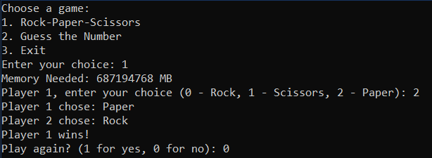
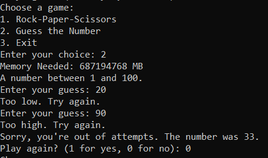
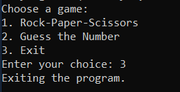

# Лабораторная работа №4 #

## Наследование ##

## Вариант 2 ##

## Реализация/ход работы ##

Создали класс ***GameWindow***:

```c++
//..
class GameWindow : public Window {//1
public:
    GameWindow(int id, int height, int width, bool areAdministratorRightsGranted, Settings* settings);//1
    virtual void doAction() = 0;//1

protected:
    Settings* settings;//1
};
```

Реализовали 2 класса-наследника (***RockPaperScissorsGameWindow*** и ***GuessNumberGameWindow***) 
от класса ***GameWindow***:

```c++
\\..
class RockPaperScissorsGameWindow : public GameWindow {//1
public:
	RockPaperScissorsGameWindow(int id, int height, int width, bool areAdministratorRightsGranted, Settings* settings);//1
	void doAction() override;//1
	int calculateMemoryNeeded();//1
};
```

```c++
\\..
class GuessNumberGameWindow : public GameWindow {
public:
    GuessNumberGameWindow(int id, int height, int width, bool areAdministratorRightsGranted, Settings* settings);//1
    void doAction() override;//1
    int calculateMemoryNeeded();//1

private:
    int targetNumber;//1
};
```

#### Результат работы программы ####

Вывод меню для выбора игры "Камень-ножницы-бумага":



Вывод меню для выбора игры "Угадай число":





#### Вывод ####

Научились создавать простейшие классы-наследники.
