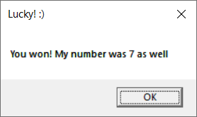
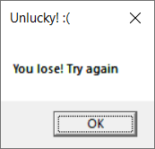

<p style="text-align: center;">Министерство образования Республики Беларусь</p>
<p style="text-align: center;">Учреждение образования</p>
<p style="text-align: center;">“Брестский Государственный технический университет”</p>
<p style="text-align: center;">Кафедра ИИТ</p>
<div style="margin-bottom: 10em;"></div>
<p style="text-align: center;">Лабораторная работа №2</p>
<p style="text-align: center;">По дисциплине “Системное программирование”</p>
<p style="text-align: center;">Тема: “Создание программы с графическим пользовательским интерфейсом в ОС Windows”</p>
<div style="margin-bottom: 10em;"></div>
<p style="text-align: right;">Выполнил:</p>
<p style="text-align: right;">Студент 3 курса</p>
<p style="text-align: right;">Группы ПО-8</p>
<p style="text-align: right;">Лобарев А. М.</p>
<p style="text-align: right;">Проверил:</p>
<p style="text-align: right;">Ситковец Я. С.</p>
<div style="margin-bottom: 10em;"></div>
<p style="text-align: center;">Брест 2023</p>

---
## Цель работы ##
Научиться создавать простейшие приложения с графическим пользовательским интерфейсом в ОС Windows.
## Вариант №16 (4) ##
Создать приложение с кнопкой и полем для ввода текста. По нажатию на кнопку проверять, угадал ли пользователь загаданное число.
## Реализация/ход работы ##
Переменные дескрипторов кнопки и текстового поля:
```C++
HWND BUTTON;
HWND EDIT;
```
Отрисовка кнопки и текстового поля:
```C++
 BUTTON = CreateWindowW(TEXT("button"), TEXT("Check your guess"),
                WS_VISIBLE | WS_CHILD,
                30, 40, 200, 50,
                hWnd, (HMENU)1, NULL, NULL);

 EDIT = CreateWindowW(TEXT("edit"), TEXT("Enter number from 1 to 10"),
                WS_VISIBLE | WS_CHILD,
                400, 40, 200, 50,
                hWnd, (HMENU)2, NULL, NULL);
```
Обработка нажатия на кнопку, считывание текста и проверка, угадал ли пользователь:
```C++
 TCHAR buffer[256];
 GetWindowText(EDIT, buffer, 256);

 TCHAR myNumber[] = _T("7");

 if (lstrcmp(buffer, myNumber) == 0)
 {
     MessageBox(hWnd, _T("You won! My number was 7 as well"), _T("Lucky! :)"), MB_OK);
 }
 else
 {
     MessageBox(hWnd, _T("You lose! Try again"), _T("Unlucky! :("), MB_OK);
 }
```

---

Скрины работы:

 

 

 