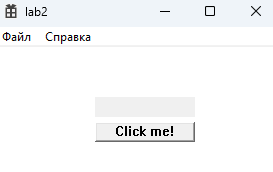
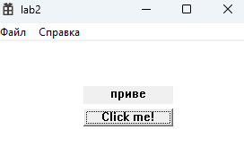

# Лабораторная работа №2 #

## Создание программы с графическим интерфейсом в ОС Windows ##

## Вариант 2 ##

### Цель работы: Научиться создавать простейшие приложения с графическим пользовательским интерфейсом в ОС Windows ###

**условие:**

***Создать приложжение с кнопкой и полем для отоюражения текста. По нажатию на кнопку необходимо выводить следдующую букву на экран ( после каждого нажатия на кнопку должна добавляться одна буква, например, после 3ч нажатий на экране будет "при", после 5 - "приве").***

Создание кнопки

```C++
CreateWindowW(TEXT("button"), TEXT("Click me!"),
            WS_VISIBLE | WS_CHILD,
            100, 75, 100, 20,
            hWnd, (HMENU)12, NULL, NULL);
```

Создание текстового поля

```C++
TextBox = CreateWindowW(TEXT("static"), TEXT(""),
            WS_VISIBLE | WS_CHILD | ES_CENTER,
            100, 50, 100, 20,
            hWnd, (HMENU)2, NULL, NULL);
```

Обработка нажатия кнопки

```C++
if (iterator != outputStr.size()) {
                    std::string str="";
                    for (int i = 0; i < iterator+1; i++) {
                        str += outputStr[i];
                    }
                    iterator++;
                    SetWindowTextA(TextBox, str.c_str());
                }
```

#### Результат работы программы ####



кнопка нажата 2 раза


кнопка нажата 5 раз



#### Вывод ####

Научились создавать простейшие приложения с графическим пользовательским интерфейсом в ОС Windows.
