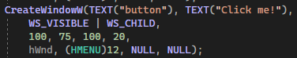
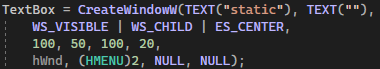
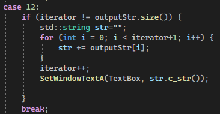
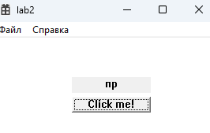

# Лабараторная работа №2 #
## Создание программы с графическим интерфейсом в ОС Windows. ##
## Вариант 2 ##
### Цель работы: Научиться создавать простейшие приложения с графическим пользовательским интерфейсом в ОС Windows. ###
**условие**

***Создать приложжение с кнопкой и полем для отоюражения текста. По нажатию на кнопку необходимо выводить следдующую букву на экран ( после каждого нажатия на кнопку должна добавляться одна буква, например, после 3ч нажатий на экране будет "при", после 5 - "приве").***

Создание кнопки

Создание текстового поля

Обработка нажатия кнопки

#### Результат работы программы ####

кнопка нажата 2 раза

кнопка нажата 5 раз

#### Вывод: ####

Научились создавать простейшие приложения с графическим пользовательским интерфейсом в ОС Windows.