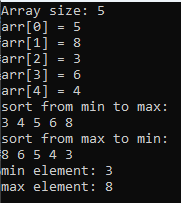

# Лабораторная работа №3 #

## DLL: динамически загружаемые библиотеки ##

## Вариант 2 ##

### Цель работы: Научиться создавать простейшие DLL ###

#### **Условие** ####

Создать библиотеку, сортирующую массив по убыванию и возрастанию, а также находящую максимум/минимум в массиве.

[Объявление функций](./include/SortAndFindMinMax.h)

[Реаализация функций](./include/SortAndFindMinMax.cpp)

[Основная программа](./src/main.cpp)

#### Результат ####

#### Вывод ####

Научились создавать простейшие DLL.
