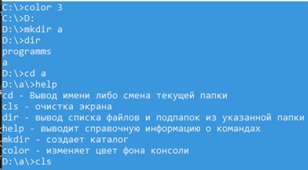
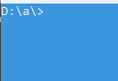

# Лабораторная работа №4 #

## Наследование ##

## Вариант 5 ##

## Реализация ##

***Задание***: Создать класс ***ConsoleWindow***. В данном классе добавляются поля ***commandsList*** и ***color (int)***. Реализовать класс ***Command*** с абстрактным методом ***doAction***. Реализовать минимум 5 различных наследников от него для разных команд (копирование, удаление, смена активной папки и т.д.) Список доступных команд подгружается при создании. Сделать несколько различных объектов одной команды с разными параметрами. Реализовать вызов команды по её имени. ***MemoryNeeded*** должно передаваться из вызываемой команды. В основной программе необходимо реализовать логику использования всех созданных команд.

Класс ***Window***:

```c++
#pragma once
#ifndef WINDOWH
#define WINDOWH

class Window
{
public:
	int id;
	int height;
	int width;
	int memoryNeeded;
	bool areAdministratorRightsGranted;
	bool isShown;
	Window(int _height, int _width, bool _areAdministartorRightsGrated, int _memoryNeeded = 0, bool _isShown = true);
	void doWork(int _memoryNeeded);
	void  ShowOrHide();
};

#endif
```

Класс-наследник ***ConsoleWindow*** от класса ***Window***:

```c++
#pragma once
#ifndef CONSOLEWINDOWH
#define CONSOLEWINDOWH
#include "Window.h"
#include "vector"

class Command;

class ConsoleWindow : public Window
{
public:
	ConsoleWindow(int _height, int _width, bool _rights, int _memoryNeeded = 0, bool _isShown = true, int _color = 0);
	int color;
	std::vector<Command*> commandList;
};

#endif
```

Класс ***Command***:

```c++
#pragma once
#ifndef COMMANDH
#define COMMANDH
#include "ConsoleWindow.h"
#include "folder.h"
#include "tempStrings.h"

class Command
{
public:
	virtual void doAction(ConsoleWindow &w, tempStrings &tempStrs) = 0;
	virtual ~Command() = default;
};

#endif
```

Класс-наследник ***Cls*** от класса ***Command***:

```c++
#pragma once
#ifndef CLSH
#define CLSH
#include "CommandClass.h"
class Cls : public Command
{
public:
	void doAction(ConsoleWindow &w, tempStrings& tempStrs) override;
	virtual ~Cls() = default;
};

#endif
```

### Результат работы программы ###





#### Вывод ####

Научились создавать простейшие классы-наследники.
