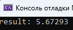
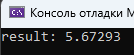

# Лабораторная работа №5 #

## Многопоточность ##

## Вариант 3 ##

## Реализация ##

### **Условие** ###

Создать три потока, выполняющих различные арифметические операции над переменной типа ***float***.

Необходимо написать 2 программы, используя в них несколько потоков. Одну из программ реализовать через атомные переменные, вторую – через mutex.

Файлы проекта:

- [lab5.atomic.cpp](./src/lab5.atomic.cpp)

- [lab5.mutex.cpp](./src/lab5.mutex.cpp)

#### Результаты работы программ ####

atomic:

mutex:

#### Вывод ####

Научились работать с многопоточностью в приложениях.
