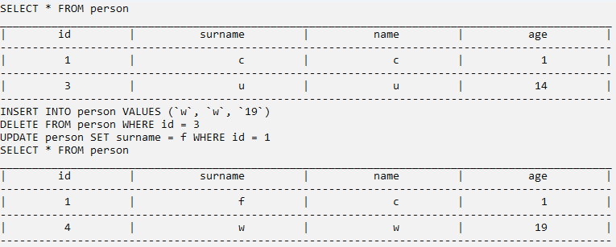

# Лабораторная работа №6 #

## Разработка консольного приложения в Windows ##

## Вариант 5 ##

## Реализация ##

### **Условие** ###

Создать консольную программу для работы с базой данных. Программа должна уметь выводить в консоль данные из БД, записывать новые данные, а также редактировать и удалять уже существующие.

Реализация класса Response:

- [Response.cpp](./src/Response.cpp)

#### Результат работы программы ####

#### Вывод ####

Отработали навыки по созданию консольных приложений в Windows, используя C++.
