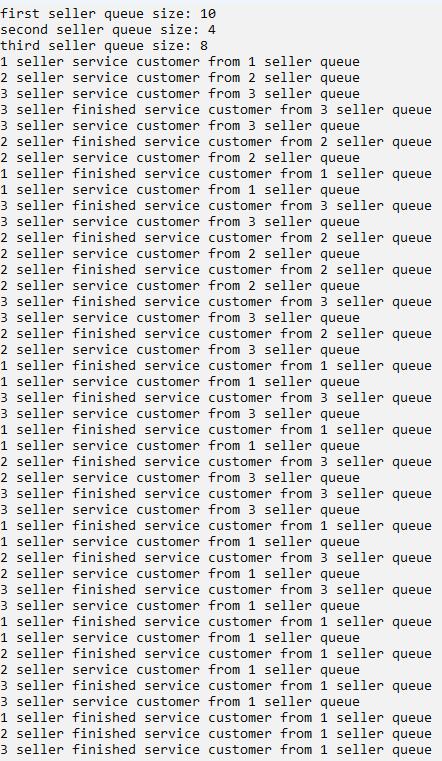

# Лабораторная работа №7 #

## Синхронизация потоков ##

## Вариант 3 ##

### **Условие** ###

Создать симулятор рынка с минимум 3 торговцами. Торговцы обслуживают по одному человеку в очереди, а после того, как очередь закончилась – начинаю обслуживать людей в очередях других торговцев.

### Файлы проекта ###

[lab7.cpp](./src/lab7.cpp)

#### Результаты работы программ ####

