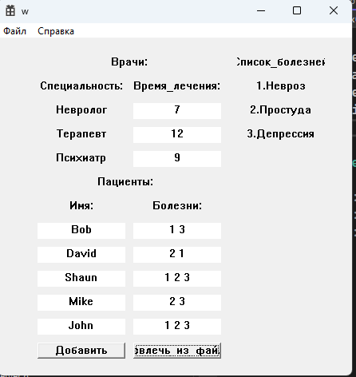
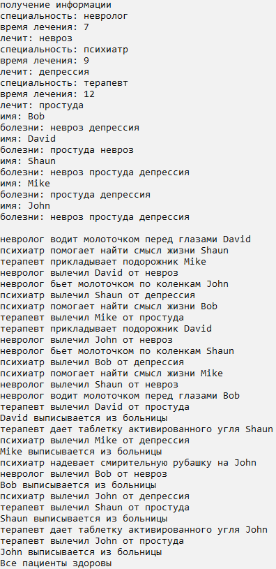

# Лабораторная работа №8 #

## Обобщение знаний ##

## Вариант 3 ##

### **Условие** ###

Создать симулятор больницы. \
Необходимые классы: разные виды врачей, пациенты.\
Заполняемые с помощью WinAPI данные: вся информация о врачах и пациентах.\
Суть работы: врачи посещают пациентов, за которыми закреплены и лечат определённые симптомы в течение некоторого времени в зависимости от специальности. У врача есть максимальное время лечения, после которого он уходит к следующему пациенту. Два врача не могут одновременно обслуживать одного пациента. Как только пациент вылечен – он выписывается из больницы и врачи больше к нему не ходят. Программа завершается, когда все пациенты вылечены.

### Файлы ###

Программа-клиент, написанная с помощью WinAPI

[winapi.cpp](./src/winapi.cpp)

Основная программа

[main.cpp](./src/main.cpp)

Заголовочный файл DLL

[hospitalLibrary.h](./include/hospitalLibrary.h)

#### Результаты работы программ ####

