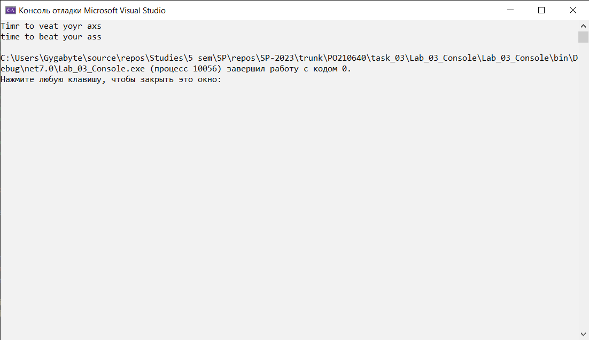

## Цель работы
Научиться создавать простейшие DLL.
## Вариант №16 (8 - old)
Создать библиотеку, корректирующую ошибки в тексте по заданному шаблону (реализовать массив корректных слов, по которому сверять слова на ошибки). Условимся, что слова не могут отличаться от правильных по длине.
## Реализация/ход работы
Свойства класса `SpellingChecker`:
```C#
private List<string> Glossary { get; set; }
private HashSet<string> HashGlossary { get; set; }
private Dictionary<int, List<string>> Glossaries { get; set; }
```
Конструктор класса:
```C#
public SpellingChecker(List<string> glossary)
{
    Glossary = new(glossary.Count);
    foreach (string str in glossary)
    {
        Glossary.Add(str.ToLower());
    }
    Glossary.Sort();

    HashGlossary = new(glossary);

    Glossaries = new();

    foreach (string word in Glossary)
    {
        int length = word.Length;
        if (Glossaries.ContainsKey(length)) Glossaries[length].Add(word);
        else
        {
            Glossaries.Add(length, new List<string>());
            Glossaries[length].Add(word);
        }
    }
}
```
Основной метод поиска наилучшего `слова`-совпадения:
```C#
public string CheckWord(string word)
{
    string lowWord = word.ToLower();

    if (HashGlossary.Contains(lowWord)) return word;

    int length = lowWord.Length;
    if (!Glossaries.ContainsKey(length)) return word;

    var list = Glossaries[length];

    int maxMatches = -1;
    double minDistance = double.MaxValue;
    string bestGuess = word;

    foreach (var item in list)
    {
        var matches = CountMathes(lowWord, item);
        if (matches < maxMatches) continue;

        if (matches > maxMatches)
        {
            bestGuess = item;
            maxMatches = matches;
            minDistance = CountDistance(lowWord, item);
            continue;
        }

        var distance = CountDistance(lowWord, item);
        if (distance < minDistance)
        {
            bestGuess = item;
            maxMatches = matches;
            minDistance = distance;
        }
    }

    return bestGuess;
}
```
Пример кода пользовательского приложения:
```C#
using SpellingCheckerApp;

var path = @"C:\Users\Gygabyte\source\repos\Studies\5 sem\SP\repos\SP-2023\trunk\PO210640\task_03\Lab_03_Console\Lab_03_Console\Source\5000-words.txt";

var reader = new StreamReader(path);

var vocabulary = new List<string>(reader.ReadToEnd().Split().Select(str => str.Trim()));

var checker = new SpellingChecker(vocabulary);
var text = "Timr to veat yoyr axs";
var result = checker.CheckText(text);

Console.WriteLine(text);
Console.WriteLine(result);
```

---

Скрины работы:


