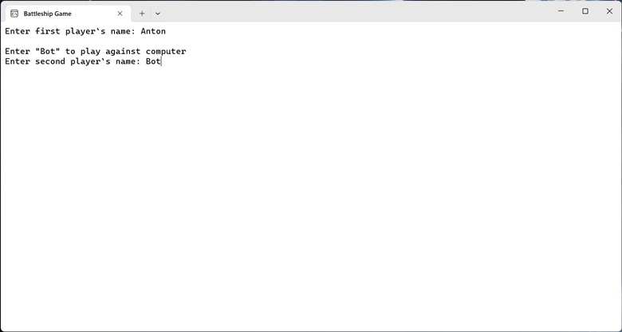
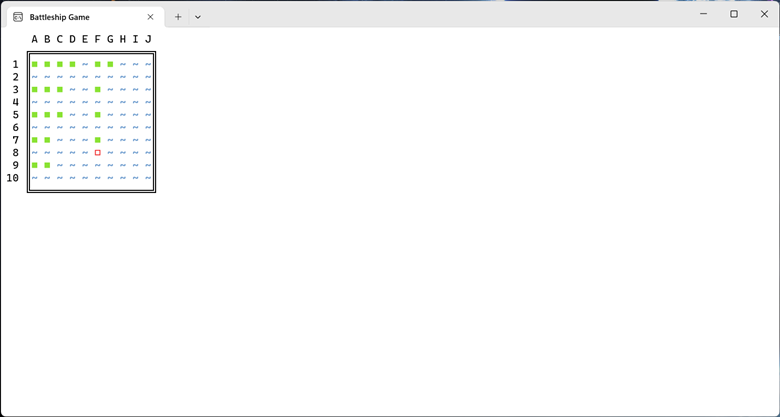
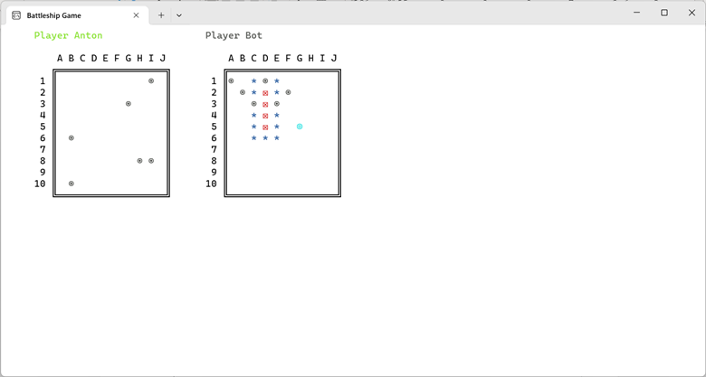
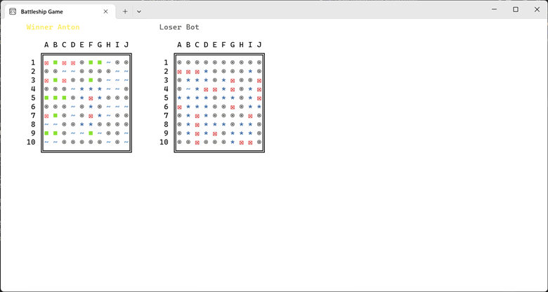

## Цель работы
Отработать навыки по созданию консольных приложений в Windows.
## Вариант №4
Создать консольный морской бой. Программа должна выводить в консоль игровые поля (корабли на поле оппонента должны быть скрыты) и иметь поддержку игры с компьютером (заполняет поле и делает ходы случайным образом, например).
## Реализация/ход работы
Класс корабля:
```C#
public enum ShipType
{
    Carrier = 4,
    Battleship = 3,
    Cruiser = 2,
    Destroyer = 1
}

internal class Ship : ICloneable
{
    public ShipType ShipType { get; }
    public int Length => (int)ShipType;
    public bool[] Hits { get; }
    public bool IsSunk => Hits.All(x => x);

    public Ship(ShipType shipType)
    {
        ShipType = shipType;
        Hits = new bool[Length];
    }

    public object Clone()
    {
        var clone = new Ship(ShipType);
        Hits.CopyTo(clone.Hits, 0);

        return clone;
    }
}
```
Класс маршрута корабля:
```C#
internal enum Orientation
{
    Left,
    Top,
    Right,
    Bottom,
}

internal class ShipRoute : ICloneable
{
    public Ship Ship { get; set; }
    public Point Start { get; set; }
    public Orientation Orientation { get; set; }

    public ShipRoute(Ship ship, Point start, Orientation orientation)
    {
        Ship = ship;
        Start = start;
        Orientation = orientation;
    }


    public void GetShot(Point point)
    {
        var (x, y) = point;
        var (startX, startY) = Start;

        var index = Orientation switch
        {
            Orientation.Left => startX - x,
            Orientation.Top => startY - y,
            Orientation.Right => x - startX,
            Orientation.Bottom => y - startY,
            _ => throw new NotImplementedException(),
        };

        Ship.Hits[index] = true;
    }

    public object Clone()
    {
        var ship = (Ship)Ship.Clone();
        var start = new Point(Start.X, Start.Y);
        var orientation = Orientation;

        return new ShipRoute(ship, start, orientation);
    }
}
```
Основной код для реализации клетки игрового поля:
```C#
public enum CellState
{
    Empty,
    FogOfWar,
    Ship,
    HoloShip,
    IncorrectHoloShip,
    Hit,
    HoloHit,
    IncorrectHoloHit,
    Miss,
    Sunk,
    Clear,
}

internal static class CellStateExtension
{
    public static char ToSymbol(this CellState cellState)
    {
        return cellState switch
        {
            CellState.Empty => '~',
            CellState.FogOfWar => ' ',
            CellState.Ship => '■', // ∎
            CellState.HoloShip => '□',
            CellState.IncorrectHoloShip => '□',
            CellState.Hit => '☒',
            CellState.HoloHit => '◎',
            CellState.IncorrectHoloHit => '◎',
            CellState.Miss => '◉',
            CellState.Sunk => '☒',
            CellState.Clear => '*',
            _ => throw new NotImplementedException(),
        };
    }

    public static ConsoleColor ToColor(this CellState cellState)
    {
        return cellState switch
        {
            CellState.Empty => ConsoleColor.Blue,
            CellState.FogOfWar => ConsoleColor.Gray,
            CellState.Ship => ConsoleColor.Green,
            CellState.HoloShip => ConsoleColor.Cyan,
            CellState.IncorrectHoloShip => ConsoleColor.Red,
            CellState.Hit => ConsoleColor.Red,
            CellState.HoloHit => ConsoleColor.Cyan,
            CellState.IncorrectHoloHit => ConsoleColor.Red,
            CellState.Miss => ConsoleColor.DarkGray,
            CellState.Sunk => ConsoleColor.DarkRed,
            CellState.Clear => ConsoleColor.DarkBlue,
            _ => throw new NotImplementedException(),
        };
    }
}

internal abstract class Cell
{
    public bool IsHit { get; set; }
    public abstract CellState CellState { get; }
    public virtual void Shoot(Point point)
    {
        IsHit = true;
    }
}
```
Код для показа рамки поля:
```C#
internal class Frame
{
    public int Length { get; init; }
    public int Width { get; init; }

    public Point Offset { get; init; }

    private char[] Elements { get; init; }
    private string _frameStr = string.Empty;
    private string FrameStr
    {
        get
        {
            if (_frameStr == string.Empty)
            {
                _frameStr = GetFrame();
            }

            return _frameStr;
        }
    }

    public char LeftBottom => Elements[0];
    public char LeftTop => Elements[1];
    public char RightTop => Elements[2];
    public char RightBottom => Elements[3];
    public char Horizontal => Elements[4];
    public char Vertical => Elements[5];

    public Frame(int length, int width)
    {
        Length = length;
        Width = width;

        var xOffset = Length.ToString().Length + 2;
        var yOffset = 2;
        Offset = new Point(xOffset, yOffset);

        Elements = ['╚', '╔', '╗', '╝', '═', '║'];
    }

    private string GetFrame()
    {
        var sb = new StringBuilder();

        var paddingLentgh = Length.ToString().Length;
        var padding = new string(' ', paddingLentgh + 1);


        // Top
        sb.Append(padding);
        for (char ch = 'A'; ch < 'A' + Width; ch++)
        {
            sb.Append(' ');
            sb.Append(ch);
        }
        sb.AppendLine();

        var topLine = padding + LeftTop + new string(Horizontal, Width * 2 - 1) + RightTop;
        sb.AppendLine(topLine);

        // Middle
        var midLine = Vertical + new string(' ', Width * 2 - 1) + Vertical;
        for (int i = 0; i < Length; i++)
        {
            var temp = (i + 1).ToString().PadLeft(paddingLentgh) + ' ' + midLine;
            sb.AppendLine(temp);
        }

        // Bottom
        var bottomLine = padding + LeftBottom + new string(Horizontal, Width * 2 - 1) + RightBottom;
        sb.AppendLine(bottomLine);

        return sb.ToString();
    }

    private static void NextLine(int left)
    {
        var (_, Top) = Console.GetCursorPosition();
        Console.SetCursorPosition(left, Top + 1);
    }


    public void Draw(int left, int top)
    {
        var paddingLentgh = Length.ToString().Length;
        var padding = new string(' ', paddingLentgh + 1);


        // Top
        Console.SetCursorPosition(left, top);
        Console.Write(padding);
        for (char ch = 'A'; ch < 'A' + Width; ch++)
        {
            Console.Write(' ');
            Console.Write(ch);
        }
        NextLine(left);

        var topLine = padding + LeftTop + new string(Horizontal, Width * 2 - 1) + RightTop;
        Console.Write(topLine);
        NextLine(left);

        // Middle
        var midLine = Vertical + new string(' ', Width * 2 - 1) + Vertical;
        for (int i = 0; i < Length; i++)
        {
            var temp = (i + 1).ToString().PadLeft(paddingLentgh) + ' ' + midLine;
            Console.Write(temp);
            NextLine(left);
        }

        // Bottom
        var bottomLine = padding + LeftBottom + new string(Horizontal, Width * 2 - 1) + RightBottom;
        Console.Write(bottomLine);
        NextLine(left);
    }


    public override string ToString()
    {
        return FrameStr;
    }
}
```
Собственно игровое поле:
```C#
internal class Board
{
    public int Height { get; init; }
    public int Width { get; init; }

    public bool End => ShipRoutes.All(x => x.Ship.IsSunk);

    private List<ShipRoute> ShipRoutes { get; init; }

    private Cell[,] Cells { get; init; }
    private Cell[,] HoloCells { get; init; }
    private bool IsAddingHolo { get; set; }

    private Frame Frame { get; init; }

    public Board(int height, int width)
    {
        Height = height;
        Width = width;

        Frame = new Frame(Height, Width);

        ShipRoutes = [];

        Cells = new Cell[Height, Width];
        HoloCells = new Cell[Height, Width];
        for (int i = 0; i < Height; i++)
        {
            for (int j = 0; j < Width; j++)
            {
                Cells[i, j] = new EmptyCell();
                HoloCells[i, j] = new EmptyCell();
            }
        }
    }


    public void AddShip(Ship ship, Point start, Orientation orientation)
    {
        var shipRoute = new ShipRoute(ship, start, orientation);
        ShipRoutes.Add(shipRoute);

        var (x, y) = start;
        for (int i = 0; i < ship.Length; i++)
        {
            Cells[y, x] = new ShipCell(shipRoute);

            switch (orientation)
            {
                case Orientation.Left:
                    x--;
                    break;

                case Orientation.Top:
                    y--;
                    break;

                case Orientation.Right:
                    x++;
                    break;

                case Orientation.Bottom:
                    y++;
                    break;
            }
        }
    }


    public bool MoveHoloShip(ShipRoute shipRoute, ShipRoute? prevShipRoute = null)
    {
        if (IsAddingHolo && prevShipRoute is null)
        {
            throw new Exception("Cannot add holo ship when adding holo");
        }

        if (prevShipRoute is not null)
        {
            RemoveHoloShip(prevShipRoute);
        }

        var canAddShip = AddHoloShip(shipRoute);
        return canAddShip;
    }

    private bool AddHoloShip(ShipRoute shipRoute)
    {
        var ship = shipRoute.Ship;
        var start = shipRoute.Start;
        var orientation = shipRoute.Orientation;

        bool canAddShip = CanAddShip(shipRoute);
        var cellState = canAddShip ? CellState.HoloShip : CellState.IncorrectHoloShip;

        var (x, y) = start;
        for (int i = 0; i < ship.Length; i++)
        {
            y = (y + Height) % Height;
            x = (x + Width) % Width;
            HoloCells[y, x] = new HoloShipCell(shipRoute, cellState);

            switch (orientation)
            {
                case Orientation.Left:
                    x--;
                    break;

                case Orientation.Top:
                    y--;
                    break;

                case Orientation.Right:
                    x++;
                    break;

                case Orientation.Bottom:
                    y++;
                    break;
            }
        }

        IsAddingHolo = true;
        return canAddShip;
    }

    private bool CanAddShip(ShipRoute shipRoute)
    {
        var start = shipRoute.Start;
        var orientation = shipRoute.Orientation;
        var lengthShip = shipRoute.Ship.Length;

        var topLeft = orientation switch
        {
            Orientation.Left => new Point(start.X - lengthShip, start.Y - 1),
            Orientation.Top => new Point(start.X - 1, start.Y - lengthShip),
            Orientation.Right => new Point(start.X - 1, start.Y - 1),
            Orientation.Bottom => new Point(start.X - 1, start.Y - 1),
            _ => throw new NotImplementedException(),
        };

        var bottomRight = orientation switch
        {
            Orientation.Left => new Point(start.X + 1, start.Y + 1),
            Orientation.Top => new Point(start.X + 1, start.Y + 1),
            Orientation.Right => new Point(start.X + lengthShip, start.Y + 1),
            Orientation.Bottom => new Point(start.X + 1, start.Y + lengthShip),
            _ => throw new NotImplementedException(),
        };

        var (xShip, yShip) = start;
        for (int i = 0; i < lengthShip; i++)
        {
            if (yShip < 0 || yShip >= Height || xShip < 0 || xShip >= Width)
            {
                return false;
            }

            switch (orientation)
            {
                case Orientation.Left:
                    xShip--;
                    break;

                case Orientation.Top:
                    yShip--;
                    break;

                case Orientation.Right:
                    xShip++;
                    break;

                case Orientation.Bottom:
                    yShip++;
                    break;
            }
        }

        var height = Height;
        var width = Width;

        for (int y = topLeft.Y; y <= bottomRight.Y; y++)
        {
            for (int x = topLeft.X; x <= bottomRight.X; x++)
            {
                if (y >= 0 && y < height && x >= 0 && x < width)
                {
                    if (Cells[y, x] is not EmptyCell)
                    {
                        return false;
                    }
                }
            }
        }

        return true;
    }

    public void RemoveHoloShip(ShipRoute shipRoute)
    {
        var ship = shipRoute.Ship;
        var start = shipRoute.Start;
        var orientation = shipRoute.Orientation;

        var (x, y) = start;
        for (int i = 0; i < ship.Length; i++)
        {
            y = (y + Height) % Height;
            x = (x + Width) % Width;
            HoloCells[y, x] = new EmptyCell();

            switch (orientation)
            {
                case Orientation.Left:
                    x--;
                    break;

                case Orientation.Top:
                    y--;
                    break;

                case Orientation.Right:
                    x++;
                    break;

                case Orientation.Bottom:
                    y++;
                    break;
            }
        }

        IsAddingHolo = false;
    }

    public void SubmitHoloShip(ShipRoute shipRoute)
    {
        var ship = shipRoute.Ship;
        var start = shipRoute.Start;
        var orientation = shipRoute.Orientation;

        var (x, y) = start;

        if (HoloCells[y, x] is not HoloShipCell holoShip || holoShip.ShipRoute != shipRoute)
        {
            throw new Exception("Can't sumbit adding non-existent ship");
        }

        for (int i = 0; i < ship.Length; i++)
        {
            Cells[y, x] = new ShipCell(shipRoute);

            switch (orientation)
            {
                case Orientation.Left:
                    x--;
                    break;

                case Orientation.Top:
                    y--;
                    break;

                case Orientation.Right:
                    x++;
                    break;

                case Orientation.Bottom:
                    y++;
                    break;
            }
        }

        ShipRoutes.Add(shipRoute);
    }


    private bool Shoot(Point point)
    {
        var isValid = true;

        var (x, y) = point;
        var cell = Cells[y, x];

        if (cell.IsHit)
        {
            return !isValid;
        }

        cell.Shoot(point);

        if (cell is ShipCell shipCell && shipCell.IsSunk)
        {
            Sink(shipCell.ShipRoute);
        }

        return isValid;
    }
    private bool AddHoloShot(Point point)
    {
        var x = point.X;
        var y = point.Y;
        var cell = Cells[y, x];

        bool isPossible = cell.IsHit == false;
        var cellState = isPossible ? CellState.HoloHit : CellState.IncorrectHoloHit;

        HoloCells[y, x] = new HoloShotCell(cellState);

        return isPossible;
    }

    public void RemoveHoloShot(Point point)
    {
        var x = point.X;
        var y = point.Y;

        HoloCells[y, x] = new EmptyCell();
    }

    public bool MoveHoloShot(Point current, Point? prev = null)
    {
        if (IsAddingHolo && prev is null)
        {
            throw new Exception("Cannot add holo ship when adding holo");
        }

        if (prev is not null)
        {
            RemoveHoloShot(prev.Value);
        }

        var canShoot = AddHoloShot(current);
        return canShoot;
    }

    public bool SubmitHoloShot(Point point)
    {
        var (x, y) = point;
        var cell = Cells[y, x];

        bool isHit = false;

        if (cell.CellState is CellState.Ship)
        {
            isHit = true;
        }

        Shoot(point);

        return isHit;
    }

    private void Sink(ShipRoute shipRoute)
    {
        var start = shipRoute.Start;
        var orientation = shipRoute.Orientation;
        var lengthShip = shipRoute.Ship.Length;

        var topLeft = orientation switch
        {
            Orientation.Left => new Point(start.X - lengthShip, start.Y - 1),
            Orientation.Top => new Point(start.X - 1, start.Y - lengthShip),
            Orientation.Right => new Point(start.X - 1, start.Y - 1),
            Orientation.Bottom => new Point(start.X - 1, start.Y - 1),
            _ => throw new NotImplementedException(),
        };

        var bottomRight = orientation switch
        {
            Orientation.Left => new Point(start.X + 1, start.Y + 1),
            Orientation.Top => new Point(start.X + 1, start.Y + 1),
            Orientation.Right => new Point(start.X + lengthShip, start.Y + 1),
            Orientation.Bottom => new Point(start.X + 1, start.Y + lengthShip),
            _ => throw new NotImplementedException(),
        };

        var height = Height;
        var width = Width;

        for (int y = topLeft.Y; y <= bottomRight.Y; y++)
        {
            for (int x = topLeft.X; x <= bottomRight.X; x++)
            {
                if (y >= 0 && y < height && x >= 0 && x < width)
                {
                    if (Cells[y, x] is EmptyCell emptyCell && emptyCell.IsHit == false)
                    {
                        emptyCell.IsClear = true;
                        emptyCell.IsHit = true;
                    }
                }
            }
        }
    }


    public void Draw(int left, int top)
    {
        Frame.Draw(left, top);

        var height = Height;
        var width = Width;

        for (int i = 0; i < height; i++)
        {
            for (int j = 0; j < width; j++)
            {
                var cell = Cells[i, j];
                var cellState = cell.CellState;
                var symbol = cellState.ToSymbol();
                var color = cellState.ToColor();

                Console.SetCursorPosition(Frame.Offset.X + left + j * 2, Frame.Offset.Y + top + i);
                Console.ForegroundColor = color;
                Console.Write(symbol);
            }
        }

        //Console.BackgroundColor = Constants.DefaultBackground;
        Console.ForegroundColor = Constants.DefaultForeground;
    }

    public void DrawFogged(int left, int top)
    {
        Frame.Draw(left, top);

        var height = Height;
        var width = Width;

        for (int i = 0; i < height; i++)
        {
            for (int j = 0; j < width; j++)
            {
                var cell = Cells[i, j];
                var cellState = cell.CellState;
                if (cellState is CellState.Ship or CellState.Empty)
                {
                    cellState = CellState.FogOfWar;
                }
                var symbol = cellState.ToSymbol();
                var color = cellState.ToColor();

                Console.SetCursorPosition(Frame.Offset.X + left + j * 2, Frame.Offset.Y + top + i);
                Console.ForegroundColor = color;
                Console.Write(symbol);
            }
        }

        //Console.BackgroundColor = Constants.DefaultBackground;
        Console.ForegroundColor = Constants.DefaultForeground;
    }

    public void DrawHolo(int left, int top)
    {
        var height = Height;
        var width = Width;

        for (int i = 0; i < height; i++)
        {
            for (int j = 0; j < width; j++)
            {
                var cell = HoloCells[i, j];

                if (cell is EmptyCell)
                {
                    continue;
                }

                var cellState = cell.CellState;
                var symbol = cellState.ToSymbol();
                var color = cellState.ToColor();

                Console.SetCursorPosition(Frame.Offset.X + left + j * 2, Frame.Offset.Y + top + i);
                Console.ForegroundColor = color;
                Console.Write(symbol);
            }
        }

        //Console.BackgroundColor = Constants.DefaultBackground;
        Console.ForegroundColor = Constants.DefaultForeground;
    }
}
```
Классы игрока и бота:
```C#
internal class Player
{
    public string Name { get; }
    public int Score { get; private set; }

    public Board Board { get; }


    public Player(string name, Board board)
    {
        Name = name;
        Score = 0;

        Board = board;
    }

    public void AddScore(int score)
    {
        Score += score;
    }
}


internal class Bot : Player
{
    public Bot(string name, Board board) : base(name, board)
    {
    }

    public static bool Shoot(Player player)
    {
        var board = player.Board;

        var height = board.Height;
        var width = board.Width;

        var arr = new Point[height * width];
        for (int i = 0; i < height; i++)
        {
            for (int j = 0; j < width; j++)
            {
                arr[i * width + j] = new Point(i, j);
            }
        }

        Random.Shared.Shuffle(arr);

        Point? prevPoint = null;
        foreach (var point in arr)
        {
            if (board.MoveHoloShot(point, prevPoint))
            {
                var isHit = board.SubmitHoloShot(point);
                board.RemoveHoloShot(point);
                return isHit;
            }

            prevPoint = point;
        }

        return false;
    }

    public void CreateFleet()
    {
        // default settings
        var shipTypes = new Dictionary<ShipType, int>();
        var count = Enum.GetValues<ShipType>().Length;
        Enum.GetValues<ShipType>().ToList().ForEach(x => shipTypes.Add(x, count + 1 - (int)x));

        var start = new Point(0, 0);

        var random = new Random();

        var height = Board.Height;
        var width = Board.Width;

        var arr = new Point[height * width];
        for (int i = 0; i < height; i++)
        {
            for (int j = 0; j < width; j++)
            {
                arr[i * width + j] = new Point(i, j);
            }
        }

        while (shipTypes.Any(x => x.Value > 0))
        {
            var availableShipTypes = shipTypes.Where(x => x.Value > 0).Select(x => x.Key).ToArray();

            var type = random.GetItems(availableShipTypes, 1)[0];

            var orientation = random.GetItems(Enum.GetValues<Orientation>(), 1)[0];


            random.Shuffle(arr);

            var route = new ShipRoute(new Ship(type), arr[0], orientation);
            ShipRoute? prevRoute = null;

            foreach (var point in arr)
            {
                if (Board.MoveHoloShip(route, prevRoute))
                {
                    Board.SubmitHoloShip(route);
                    Board.RemoveHoloShip(route);

                    shipTypes[route.Ship.ShipType]--;

                    break;
                }

                prevRoute = route;
                route = new ShipRoute(new Ship(type), point, orientation);
            }
        }
    }
}
```
Класс игры:
```C#
internal class Game
{
    public int Width { get;}
    public int Height { get; }

    private Player Player1 { get; }
    private Player Player2 { get; }


    public Game(int height, int width)
    {
        var (name1, name2) = GetNames();

        if (string.IsNullOrWhiteSpace(name1))
        {
            name1 = "Player 1";
        }

        if (string.IsNullOrWhiteSpace(name2))
        {
            name2 = "Player 2";
        }

        Player1 = new Player(name1, new Board(height, width));

        if (name2 == "Bot")
        {
            Player2 = new Bot(name2, new Board(height, width));
        }
        else
        {
            Player2 = new Player(name2, new Board(height, width));
        }

        

        Width = width;
        Height = height;
    }

    private void SetShips()
    {
        Console.WriteLine($"Player {Player1.Name} creating fleet. Press any key to continue...");
        Console.ReadKey(true);
        Console.Clear();

        CreateFleet(Player1);
        Console.Clear();


        if (Player2 is Bot bot)
        {
            bot.CreateFleet();
            Console.Clear();
        }
        else
        {

            Console.WriteLine($"Player {Player2.Name} creating fleet. Press any key to continue...");
            Console.ReadKey(true);
            Console.Clear();

            CreateFleet(Player2);
            Console.Clear();
        }
    }


    private static (string?, string?) GetNames()
    {
        Console.CursorVisible = true;
        Console.Write("Enter first player`s name: ");
        var name1 = Console.ReadLine();

        Console.WriteLine();
        Console.WriteLine("Enter \"Bot\" to play against computer");
        Console.Write("Enter second player`s name: ");
        var name2 = Console.ReadLine();

        Console.CursorVisible = false;
        Console.Clear();

        return (name1, name2);
    }

    private void CreateFleet(Player player)
    {
        // default settings
        var shipTypes = new Dictionary<ShipType, int>();
        var count = Enum.GetValues<ShipType>().Length;
        Enum.GetValues<ShipType>().ToList().ForEach(x => shipTypes.Add(x, count + 1 - (int)x));

        var start = new Point(0, 0);
        while (shipTypes.Any(x => x.Value > 0))
        {
            var availableShipTypes = shipTypes.Where(x => x.Value > 0).Select(x => x.Key).ToList();
            var addedShipRoute = AddShipRoute(player.Board, availableShipTypes, start, new(0, 0));
            if (addedShipRoute is not null)
            {
                shipTypes[addedShipRoute.Ship.ShipType]--;
                start = addedShipRoute.Start;
            }
        }
    }

    private ShipRoute? AddShipRoute(Board board, List<ShipType> shipTypes, Point start, Point position)
    {
        var shipTypeIndex = shipTypes.Count - 1;
        var shipType = shipTypes[shipTypeIndex];

        List<Orientation> orientations = [];
        Enum.GetValues<Orientation>().ToList().ForEach(orientations.Add);

        var orientationIndex = (int)Orientation.Right;
        var orientation = orientations[orientationIndex];

        var startPoint = start;

        var currentShipRoute = new ShipRoute(new Ship(shipType), startPoint, orientation);
        ShipRoute? prevShipRoute = null;

        bool isCorrect = board.MoveHoloShip(currentShipRoute, prevShipRoute);

        var (left, top) = position;

        while (true)
        {
            //Console.Clear();
            
            board.Draw(left, top);
            board.DrawHolo(left, top);


            var keyinfo = Console.ReadKey(true);
            var key = keyinfo.Key;

            switch (key)
            {
                case ConsoleKey.Enter:
                    if (isCorrect)
                    {
                        board.SubmitHoloShip(currentShipRoute);
                        board.RemoveHoloShip(currentShipRoute);
                        return currentShipRoute;
                    }
                    break;

                case ConsoleKey.Escape:
                    board.RemoveHoloShip(currentShipRoute);
                    return null;
            }

            int coef = keyinfo.Modifiers.HasFlag(ConsoleModifiers.Shift) ? -1 : 1;

            shipTypeIndex = key switch
            {
                ConsoleKey.Tab => shipTypeIndex + coef,

                _ => shipTypeIndex,
            };

            shipTypeIndex = (shipTypeIndex + shipTypes.Count) % shipTypes.Count;
            shipType = shipTypes[shipTypeIndex];


            orientationIndex = key switch
            {
                ConsoleKey.R => orientationIndex + coef,

                _ => orientationIndex,
            };

            orientationIndex = (orientationIndex + orientations.Count) % orientations.Count;
            orientation = orientations[orientationIndex];


            startPoint = key switch
            {
                ConsoleKey.UpArrow => new Point(startPoint.X, startPoint.Y - 1),
                ConsoleKey.W => new Point(startPoint.X, startPoint.Y - 1),

                ConsoleKey.DownArrow => new Point(startPoint.X, startPoint.Y + 1),
                ConsoleKey.S => new Point(startPoint.X, startPoint.Y + 1),

                ConsoleKey.LeftArrow => new Point(startPoint.X - 1, startPoint.Y),
                ConsoleKey.A => new Point(startPoint.X - 1, startPoint.Y),

                ConsoleKey.RightArrow => new Point(startPoint.X + 1, startPoint.Y),
                ConsoleKey.D => new Point(startPoint.X + 1, startPoint.Y),

                _ => startPoint,
            };

            startPoint.X = (startPoint.X + Width) % Width;
            startPoint.Y = (startPoint.Y + Height) % Height;


            prevShipRoute = currentShipRoute;
            currentShipRoute = new ShipRoute(new Ship(shipType), startPoint, orientation);


            isCorrect = board.MoveHoloShip(currentShipRoute, prevShipRoute);
        }
    }

    private bool? Shoot(Board board, ref Point start, Point position)
    {
        var currentShot = start;
        Point? prevShot = null;

        bool isCorrect = board.MoveHoloShot(currentShot, prevShot);

        var (left, top) = position;

        while (true)
        {
            board.DrawFogged(left, top);
            board.DrawHolo(left, top);

            var keyinfo = Console.ReadKey(true);
            var key = keyinfo.Key;

            switch (key)
            {
                case ConsoleKey.Enter:
                    if (isCorrect)
                    {
                        bool isHit = board.SubmitHoloShot(currentShot);
                        board.RemoveHoloShot(currentShot);
                        start = currentShot;
                        return isHit;
                    }
                    break;

                case ConsoleKey.Escape:
                    board.RemoveHoloShot(currentShot);
                    return null;
            }

            prevShot = currentShot;

            var (x, y) = currentShot;
            currentShot = key switch
            {
                ConsoleKey.UpArrow => new Point(x, y - 1),
                ConsoleKey.W => new Point(x, y - 1),

                ConsoleKey.DownArrow => new Point(x, y + 1),
                ConsoleKey.S => new Point(x, y + 1),

                ConsoleKey.LeftArrow => new Point(x - 1, y),
                ConsoleKey.A => new Point(x - 1, y),

                ConsoleKey.RightArrow => new Point(x + 1, y),
                ConsoleKey.D => new Point(x + 1, y),

                _ => currentShot,
            };

            currentShot.X = (currentShot.X + Width) % Width;
            currentShot.Y = (currentShot.Y + Height) % Height;

            isCorrect = board.MoveHoloShot(currentShot, prevShot);
        }
    }


    private void DrawFogged(Player playerActive)
    {
        Console.Clear();

        var (left, top) = (5, 2);

        Console.SetCursorPosition(left, top - 2);
        Console.ForegroundColor = (playerActive == Player1) ? ConsoleColor.Green : ConsoleColor.Gray;
        Console.Write($"Player {Player1.Name}");

        var widthOffset = Player1.Board.Width * 2 + 10;

        Console.SetCursorPosition(widthOffset + left, top - 2);
        Console.ForegroundColor = (playerActive == Player2) ? ConsoleColor.Green : ConsoleColor.Gray;
        Console.Write($"Player {Player2.Name}");

        Console.ForegroundColor = Constants.DefaultForeground;

        Player1.Board.DrawFogged(left, top);
        Player2.Board.DrawFogged(widthOffset + left, top);
    }

    private void DrawWinner(Player winner)
    {
        Console.Clear();

        var (left, top) = (5, 2);

        Console.SetCursorPosition(left, top - 2);
        Console.ForegroundColor = (winner == Player1) ? ConsoleColor.Yellow : ConsoleColor.DarkGray;
        var str1 = (winner == Player1) ? $"Winner {Player1.Name}" : $"Loser {Player1.Name}";
        Console.Write(str1);

        var widthOffset = Player1.Board.Width * 2 + 10;

        Console.SetCursorPosition(widthOffset + left, top - 2);
        Console.ForegroundColor = (winner == Player2) ? ConsoleColor.Yellow : ConsoleColor.DarkGray;
        var str2 = (winner == Player2) ? $"Winner {Player2.Name}" : $"Loser {Player2.Name}";
        Console.Write(str2);

        Console.ForegroundColor = Constants.DefaultForeground;

        Player1.Board.Draw(left, top);
        Player2.Board.Draw(widthOffset + left, top);
    }

    public void Start()
    {
        SetShips();

        var (left, top) = (5, 2);
        DrawFogged(Player1);

        var prevShot1 = new Point(0, 0);
        var prevShot2 = new Point(0, 0);

        var currentPlayer = Player1;
        var anotherPlayer = Player2;

        var offset1 = new Point(left, top);
        var offset2 = new Point(Width * 2 + 10 + left, top);

        while (!Player1.Board.End && !Player2.Board.End)
        {
            bool? isHit = null;
            var prevShot = currentPlayer == Player1 ? ref prevShot1 : ref prevShot2;
            var offset = currentPlayer == Player1 ? offset2 : offset1;

            while ((isHit is null || isHit.Value is true) && !anotherPlayer.Board.End)
            {
                if (currentPlayer is Bot bot)
                {
                    Thread.Sleep(500);
                    isHit = Bot.Shoot(anotherPlayer);
                    DrawFogged(currentPlayer);
                }
                else
                {
                    isHit = Shoot(anotherPlayer.Board, ref prevShot, offset);
                }
            }

            if (currentPlayer == Player1)
            {
                prevShot1 = prevShot;
            }
            else
            {
                prevShot2 = prevShot;
            }

            (currentPlayer, anotherPlayer) = (anotherPlayer, currentPlayer);
            DrawFogged(currentPlayer);
        }

        var loser = currentPlayer;
        var winner = loser == Player1 ? Player2 : Player1;

        Console.Clear();
        DrawWinner(winner);

        Console.ReadKey(true);
        Console.Clear();
    }

    private Player ChangePlayer(Player currentPlayer)
    {
        return (currentPlayer == Player1 ? Player2 : Player1);
    }
}
```

---

## Скрины работы






---

## Вывод
Отработал навыки по созданию консольных приложений в Windows.
