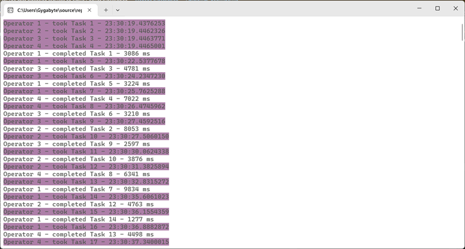

## Цель работы
Научиться синхронизировать работу с потоками в приложениях.
## Задание
Необходимо написать программу, используя знания, полученные в лабораторной работе №5. Потоки должны быть синхронизированы для выполнения поставленной задачи или код должен выполнять задачи последовательно.
## Вариант №16 (4)
Создать симулятор техподдержки. В систему постоянно поступают запросы, которые распределяются между свободными операторами.
## Реализация/ход работы
Вспомогательные члены класса `Program`:
```C#
private static Mutex Mutex { get; set; } = new();
private static Queue<string> Tasks { get; set; } = new();

private static int Id { get; set; } = 1;
```
Симуляция оператора техподдержки:
```C#
private static void Operator()
{
    Mutex.WaitOne();
    var id = Id++;
    Mutex.ReleaseMutex();
    string task;
    while (true)
    {
        Mutex.WaitOne();
        while (!Tasks.TryDequeue(out task))
        {
            Mutex.ReleaseMutex();
            Thread.Sleep(50);
            Mutex.WaitOne();
        }
        Console.BackgroundColor = ConsoleColor.Magenta;
        Console.Write($"Operator {id} - took {task} - {DateTime.Now.TimeOfDay}");
        Console.ResetColor();
        Console.WriteLine();
        Mutex.ReleaseMutex();

        var time = Random.Shared.Next(1000, 10000);
        Thread.Sleep(time);
        Console.WriteLine($"Operator {id} - completed {task} - {time} ms");
    }
}
```
Собственно симуляция:
```C#
static void Main()
{
    for (int i = 0; i < 10; i++)
    {
        Tasks.Enqueue($"Task {i + 1}");
    }

    for (int i = 0; i < 4; i++)
    {
        new Thread(Operator).Start();
    }

    int taskId = 11;
    while (true)
    {
        Thread.Sleep(Random.Shared.Next(500));

        Mutex.WaitOne();
        Tasks.Enqueue($"Task {taskId++}");
        Mutex.ReleaseMutex();
    }
}
```

---

## Скрины работы



---

## Вывод
Научился синхронизировать работу с потоками в приложениях.
