# Лабораторная работа №2 #

## Создание программы с графическим пользовательским интерфейсом в ОС Windows ##

## Вариант 5 ##

## Реализация/ход работы ##

### Цель работы: Научиться создавать простейшие приложения с графическим пользовательским интерфейсом в ОС Windows ###

#### **Условие** ####

Создать приложение с двумя кнопками и полем для отображения числа. По нажатию на кнопки число должно увеличиваться или уменьшаться в зависимости от нажатой кнопки.

Создание статического текста для отображения числа:

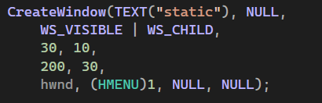

Создание кнопки для увеличения числа:

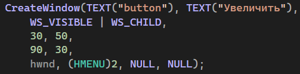

Создание кнопки для уменьшения числа:

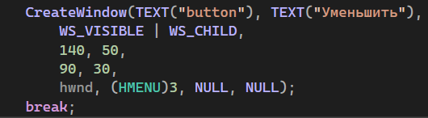

Обработка нажатия кнопки:

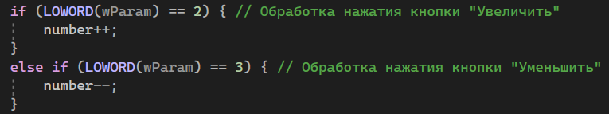

Обновление текста статического элемента для отображения нового числа:

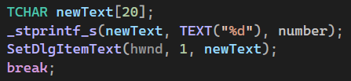

Регистрация класса окна:

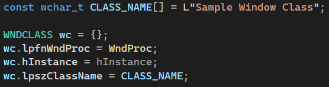

Создание окна:

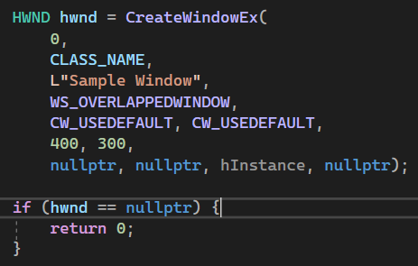

Основной цикл обработки сообщений:

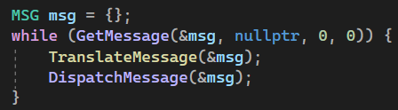

Создание кнопки для обнуления результата:

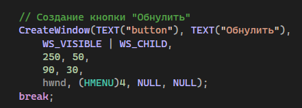

Обработка нажатия кнопки:

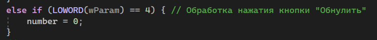

#### Результат работы программы ####

Увеличение числа:

Уменьшение числа:

Кнопка обнуления результата:

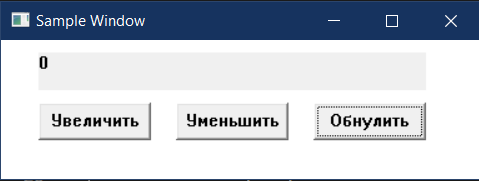

#### Вывод ####

Научились создавать простейшие приложения с графическим пользовательским интерфейсом в ОС Windows.
