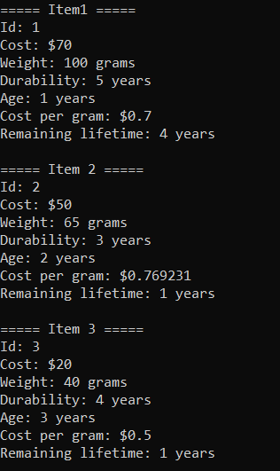

# Лабораторная работа №3 #

## DLL: динамически загружаемые библиотеки ##

## Вариант 1 ##

## Реализация/ход работы ##

### Цель работы: Научиться создавать простейшие DLL ###

#### **Условие** ####

Создать библиотеку с классом Item. В классе Item должны быть поля id, cost, weight, durability и age. В классе также должен быть конструктор и методы для подсчёта стоимости на грамм, подсчёта ”оставшегося времени существования” (durability
age) и вывода всех полей в консоль. В основной программе необходимо создать три объекта этого класса и провести с ними все возможные процедуры.

Класс Item:

```c++
class Item { ... }
```

Приватные поля класса:

```c++
private:
    int id;
    double cost;
    double weight;
    int durability;
    int age;
```

Конструктор класса Item:

```c++
Item(int id, double cost, double weight, int durability, int age)
    : id(id), cost(cost), weight(weight), durability(durability), age(age) {
}
```

Метод для подсчета стоимости на грамм:

```c++
double CalculateCostPerGram() const {
    return cost / weight;
}
```

Метод для подсчета ”оставшегося времени существования”:

```c++
int CalculateRemainingLifetime() const {
    return durability - age;
}
```

Метод для вывода информации о предмете:

```c++
void Show() const {
    std::cout << "Id: " << id << "\n";
    std::cout << "Cost: $" << cost << "\n";
    std::cout << "Weight: " << weight << " grams\n";
    std::cout << "Durability: " << durability << " years\n";
    std::cout << "Age: " << age << " years\n";
}
```

Объекты класса Item и все возможные процедуры над ними:

```c++
int main() {
    Item item1(1, 70.0, 100.0, 5, 1);
    Item item2(2, 50.0, 65.0, 3, 2);
    Item item3(3, 20.0, 40.0, 4, 3);

    cout << "===== Item1 =====" << "\n";
    item1.Show();
    cout << "Cost per gram: $" << item1.CalculateCostPerGram() << "\n";
    cout << "Remaining lifetime: " << item1.CalculateRemainingLifetime() << " years\n";
    cout << "\n";

    cout << "===== Item 2 =====" << "\n";
    item2.Show();
    cout << "Cost per gram: $" << item2.CalculateCostPerGram() << "\n";
    cout << "Remaining lifetime: " << item2.CalculateRemainingLifetime() << " years\n";
    cout << "\n";

    cout << "===== Item 3 =====" << "\n";
    item3.Show();
    cout << "Cost per gram: $" << item3.CalculateCostPerGram() << "\n";
    cout << "Remaining lifetime: " << item3.CalculateRemainingLifetime() << " years\n";
}
```

#### Результат работы программы ####



#### Вывод ####

Научились создавать простейшие DLL.
