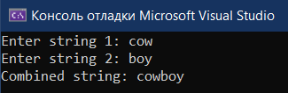

# Лабораторная работа №5 #

## Многопоточность ##

## Вариант 1 ##

## Реализация/ход работы ##

### Цель работы: Научиться работать с многопоточностью в приложениях ###

#### **Условие** ####

Создать два потока, записывающих две введённых с клавиатуры строки в одну общую.

Необходимо написать 2 программы, используя в них несколько потоков. Одну из программ реализовать через атомные переменные, вторую – через mutex.

Файл проекта (две реализации - через атомные переменные и мьютексы):

- [Main.cpp](./src/Main.cpp)

#### Результат работы программы ####

#### Вывод ####

Научились работать с многопоточностью в приложениях.
