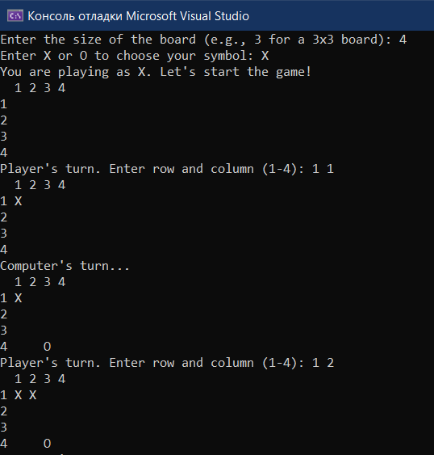
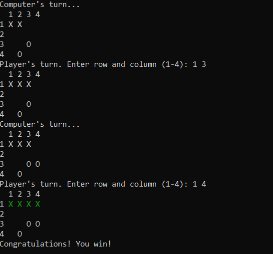

# Лабораторная работа №6 #

## Разработка консольного приложения в Windows ##

## Вариант 2 ##

## Реализация/ход работы ##

### Цель работы: Отработать навыки по созданию консольных приложений в Windows, используя C++ ###

#### **Условие** ####

Создать консольные крестики-нолики. Программа должна иметь настраиваемый размер поля, выводить в консоль игровое поле после каждого хода и иметь поддержку игры с компьютером (например, делает случайные ходы).

Файл проекта:

- [TicTacToeGame.cpp](./src/TicTacToeGame.cpp)

#### Результат работы программы ####

#### Вывод ####

Отработали навыки по созданию консольных приложений в Windows, используя C++.
