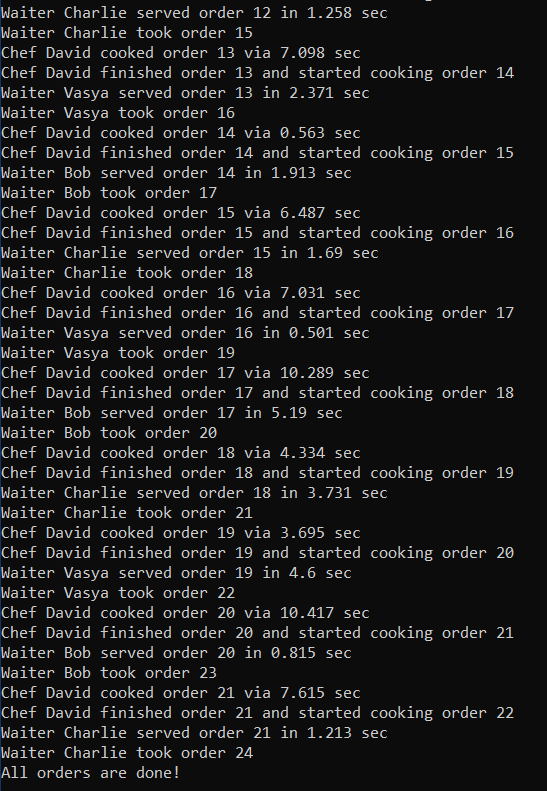

# Лабораторная работа №7 #

## Синхронизация потоков ##

## Вариант 1 ##

### **Условие** ###

Создать симулятор ресторана с 3 официантами и 1 поваром. Каждый из официантов умеет принимать заказ, после чего приносит его повару. Повар может готовить лишь один заказ, остальные официанты ждут, пока он освободится.
### Файлы проекта ###

[sp7.cpp](./src/sp7.cpp)

#### Результаты работы программ ####

#### Вывод ####

Научились синхронизировать работу с потоками в приложениях.
