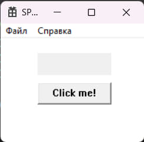
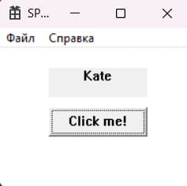
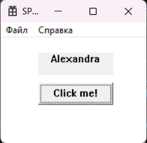

# Лабораторная работа №2

## Создание программы с графическим пользовательским интерфейсом в ОС Windows

## Вариант 6

## Реализация/ход работы

### Цель работы: Научиться создавать простейшие приложения с графическим пользовательским интерфейсом в ОС Windows

#### **Условие**

Создать приложение с кнопкой и полем для отображения имени. По нажатию на кнопку необходимо показывать случайное имя из заданного в коде списка.







```c++
// Обработка сообщений окна
LRESULT CALLBACK WndProc(HWND hWnd, UINT message, WPARAM wParam, LPARAM lParam)
{
    switch (message)
    {
    case WM_CREATE:
    {
        // Создаем кнопку и поле для отображения имени в блоке WM_CREATE
        CreateWindow(TEXT("static"), NULL,
            WS_VISIBLE | WS_CHILD | ES_CENTER,
            50, 20, 100, 30,
            hWnd, (HMENU)2, NULL, NULL);

        CreateWindow(TEXT("button"), TEXT("Click me!"),
            WS_VISIBLE | WS_CHILD,
            50, 60, 100, 30,
            hWnd, (HMENU)1, NULL, NULL);
    }
    break;
    case WM_COMMAND:
    {
        int wmId = LOWORD(wParam);
        switch (wmId)
        {
        case IDM_ABOUT:
        {
            // Показываем случайное имя при нажатии на кнопку или выборе пункта меню IDM_ABOUT
            ShowRandomName(hWnd);
        }
        break;
        case IDM_EXIT:
            DestroyWindow(hWnd);
            break;
        case 1:
            ShowRandomName(hWnd); // Показываем случайное имя при нажатии на кнопку
            break;
        default:
            return DefWindowProc(hWnd, message, wParam, lParam);
        }
    }
```

```c++
// Функция для отображения случайного имени
void ShowRandomName(HWND hWnd)
{
    srand(static_cast<unsigned int>(time(NULL)));
    int index = rand() % names.size();
    SetWindowTextA(GetDlgItem(hWnd, 2), names[index].c_str());
}
```

#### Вывод

Научились создавать простейшие приложения с графическим пользовательским интерфейсом в ОС Windows.
