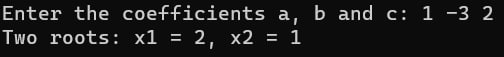

# Лабораторная работа №3 #

## DLL: динамически загружаемые библиотеки ##

### Цель работы: Научиться создавать простейшие DLL ###

## Вариант 4 ##

### **Условие** ###

Создать библиотеку, решающую квадратные уравнения.

## Реализация/ход работы ##

Код программы:

```c++
#include "QuadraticEquation.h"
#include <cmath>

int solveQuadraticEquation(double a, double b, double c, double& x1, double& x2)
{
    double discriminant = b * b - 4 * a * c;

    if (discriminant > 0)
    {
        x1 = (-b + sqrt(discriminant)) / (2 * a);
        x2 = (-b - sqrt(discriminant)) / (2 * a);
        return 2;
    }
    else if (discriminant == 0)
    {
        x1 = -b / (2 * a);
        return 1;
    }
    else
    {
        return 0;
    }
}
```

### Результат работы программы ###




#### Вывод ####

Научились создавать простейшие DLL.
