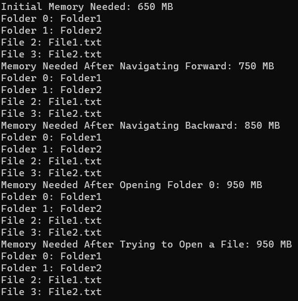

# Лабораторная работа №4 #

## Наследование ##

## Вариант 3 ##

## Реализация/ход работы ##

[main.cpp](./src/main.cpp)

### Результат работы программы ###

#### Вывод ####

Научились создавать простейшие классы-наследники.
