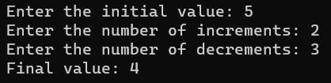

# Лабораторная работа №5 #

## Многопоточность ##

## Вариант 2 ##

## Реализация/ход работы ##

### Цель работы: Научиться работать с многопоточностью в приложениях ###

#### **Условие** ####

Создать два потока, последовательно увеличивающих и уменьшающих переменную заданное с клавиатуры количество раз на заданные с клавиатуры значения.

Необходимо написать 2 программы, используя в них несколько потоков. Одну из программ реализовать через атомные переменные, вторую – через mutex.

Файлы проекта:

- [Atomic.cpp](./src/Atomic.cpp)

- [Mutex.cpp](./src/Mutex.cpp)

#### Результат работы программы ####

#### Вывод ####

Научились работать с многопоточностью в приложениях.
