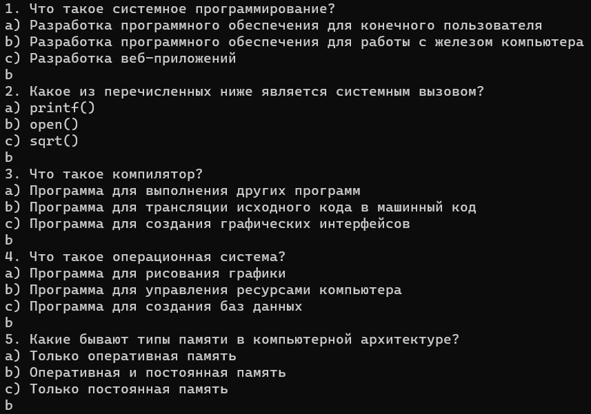
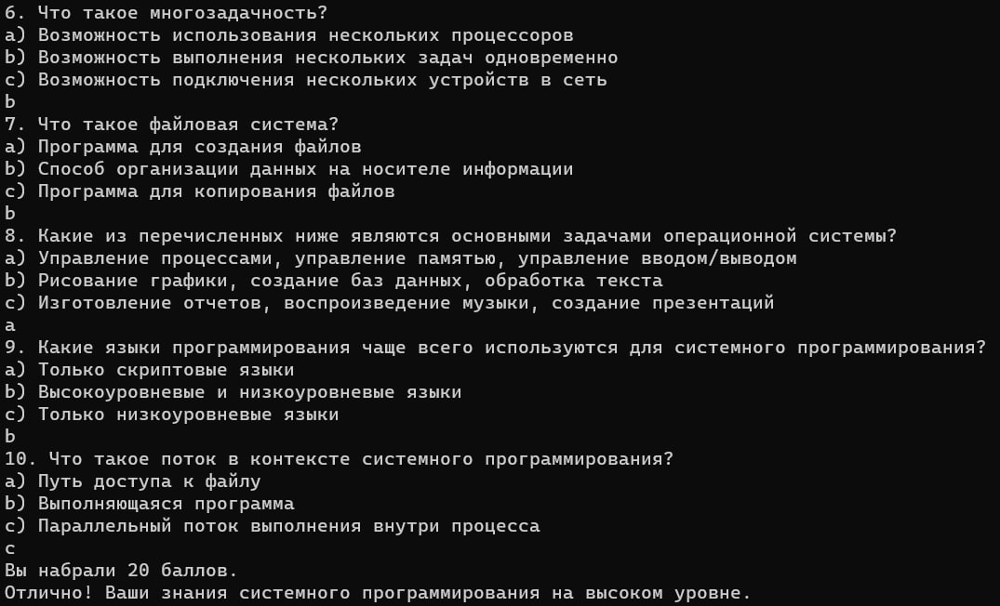

# Лабораторная работа №6 #

## Разработка консольного приложения в Windows ##

## Вариант 3 ##

## Реализация/ход работы ##

### Цель работы: Отработать навыки по созданию консольных приложений в Windows, используя C++ ###

#### **Условие** ####

Создать программу-тестировщик. Программа задаёт пользователю ряд вопросов, анализирует его ответы и выдаёт результат по набранным пользователем баллам.

Файл проекта:

- [LAB_6.cpp](./src/LAB_6.cpp)

#### Результат работы программы ####

#### Вывод ####

Отработали навыки по созданию консольных приложений в Windows, используя C++.
