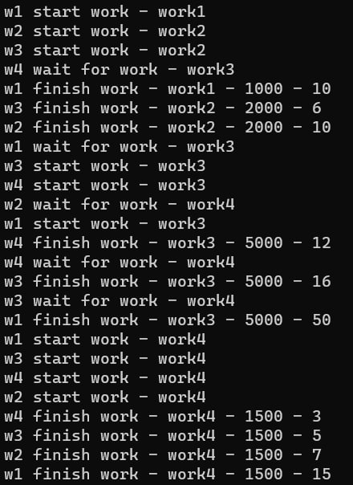

# Лабораторная работа №7 #

## Синхронизация потоков ##

## Вариант 2 ##

### **Условие** ###

Создать симулятор работы 4 рабочих. Рабочие выполняют работу за указанное в работе время. Должна быть коллективная работа, в которой может быть задействовано два и более работника. В таком случае они работают последовательно (один выполняет свою часть, остальные ждут) и переходят к новой работе только когда эта работа выполнена полностью.

### Файлы проекта ###

[Program.cs](./Lab_07\Lab_07/Program.cs)

#### Результаты работы программ ####

#### Вывод ####

Научились синхронизировать работу с потоками в приложениях.
