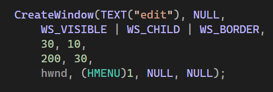
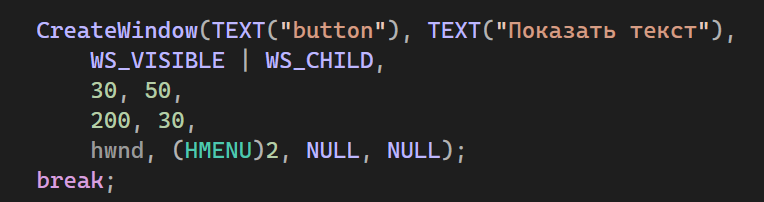
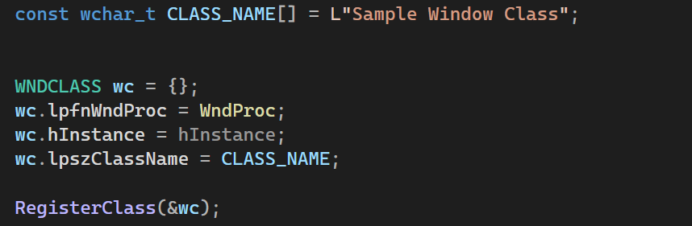
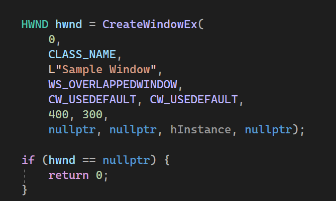
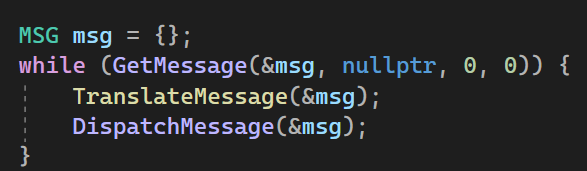
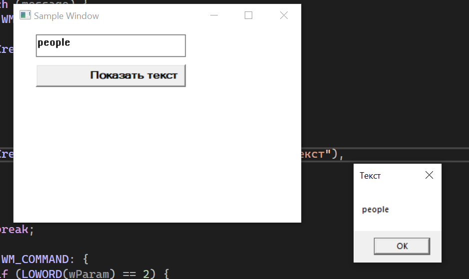

# Лабораторная работа №2 #

## Создание программы с графическим пользовательским интерфейсом в ОС Windows ##

## Вариант 1 ##

## Реализация/ход работы ##

## Цель работы ##

Научиться создавать простейшие приложения с графическим пользовательским интерфейсом в ОС Windows

### Условие ###

_Создать приложение с кнопкой и полем для ввода текста. По нажатию на кнопку приложение должно создавать всплывающее окно с введённым текстом._

Создание поля для ввода текста
     

  

Создание кнопки

        

Обработка нажатия кнопки
      
Регистрация класса окна
   
Создание окна
    
Основной цикл обработки сообщений
    

#### Результат работы программы ####

#### Вывод ####

Научились создавать простейшие приложения с графическим пользовательским интерфейсом в ОС Windows.
