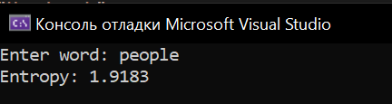
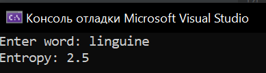

# Лабораторная работа №3 #

## DLL: динамически загружаемые библиотеки ##

## Вариант 3 ##

## Реализация/ход работы ##

## Цель работы ##

Научиться создавать простейшие DLL.

### Условие ###

_Создать библиотеку, считающую энтропию введённого слова._
```  c++

class EntropyCalculator {
public:
    static double calculateEntropy(const string& word) {
        unordered_map<char, int> charCounts;
        int totalChars = 0;

        for (char c : word) {
            charCounts[c]++; 
            totalChars++;
        }

        double entropy = 0.0;

        for (const auto& pair : charCounts) {
            double probability = static_cast<double>(pair.second) / totalChars;
            entropy -= probability * log2(probability);
        }

        return entropy;
    }
};
```
```c++

    double entropy = EntropyCalculator::calculateEntropy(word);

```
#### Результат работы программы ####



#### Вывод ####

Научились создавать простейшие DLL.
