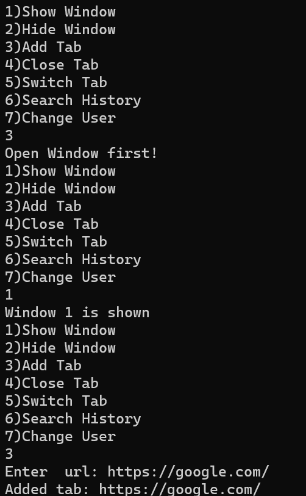
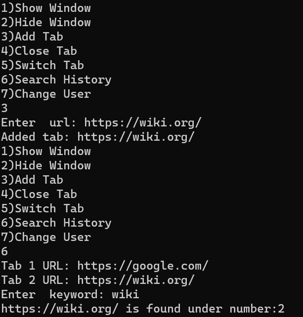
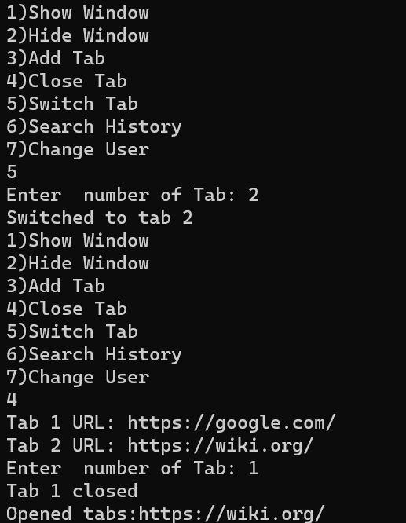
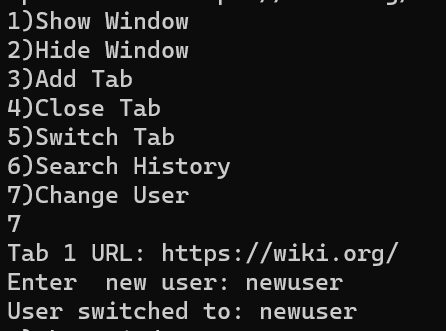

# Лабораторная работа №4 #

## Наследование ##

## Вариант 4 ##

## Реализация/ход работы ##

## Цель работы ##
Научиться создавать простейшие классы-наследники.
Для выполнения лабораторной работы необходимо создать класс ***Window***. В классе должны быть следующие поля: ***id (int), height (int), width (int), memoryNeeded (int), areAdministatorRightsGranted (boolean) и isShown (boolean)***. Требуется реализовать конструктор, задающий ***id*** и принимающий параметры ***height, width и areAdministatorRightsGranted***, метод ***doWork***, в котором будет изменяться значение ***memoryNeeded*** и метод ***showOrHide***, меняющий значение переменной ***isShown***.
Затем необходимо создать класс-наследник класса Window по варианту, реализующий имитацию заданной функциональности.
Работу выполнять на языке C++.
### Условие ###

Создать класс ***BrowserWindow***. В данном классе добавляются поля ***tabs*** (массив/список вкладок) и ***username***. Вкладку реализовать отдельным классом. Реализовать методы для добавления вкладок, переключения между ними, закрытия вкладки и поиска по истории вкладок текущего пользователя, а также смену пользователя. ***MemoryNeeded*** принимать как количество открытых вкладок плюс величину работы, выполняемой на активной вкладке. В основной программе необходимо реализовать логику использования всех созданных методов.

BrowserWindow.cpp
```  c++
#include "BrowserWindow.h"
#include "Tab.h"
using namespace std;
#include "iostream"

void print(string condition) {
    cout << "Enter  " << condition << ": ";


}

BrowserWindow::BrowserWindow(int id, int height, int width, bool areAdminRightsGranted)
    : Window(id, height, width, areAdminRightsGranted)
{
}

void BrowserWindow::addTab() {
    if (!isShown) {
        cout << "Open Window first!" << endl;
    }
    else {
        string url;
        print("url");
        cin >> url;


        Tab newTab(url);
        tabs.push_back(newTab);
        memoryNeeded = tabs.size();
        cout << "Added tab: " << url << endl;

    }

}

void BrowserWindow::switchTab() {
    if (!isShown) {
        cout << "Open Window first!" << endl;
    }
    else {
        int index;
        print("number of Tab");
        cin >> index;
        if (index - 1 >= 0 && index - 1 < tabs.size()) {
            int previousIndex = currentIndex;
            currentIndex = index - 1;
            cout << "Switched to tab " << index << endl;;
        }
    }
}

void BrowserWindow::closeTab() {
    if (!isShown) {
        cout << "Open Window first!" << endl;
    }
    else {
        int index;
        print("number of Tab");
        cin >> index;
        if (index - 1 >= 0 && index - 1 < tabs.size()) {
            tabs.erase(tabs.begin() + index - 1);
            memoryNeeded = tabs.size();
            cout << "Tab " << index << " closed" << endl;

        }
        cout << "Opened tabs:";
        for (const Tab& tab : tabs) {
            std::cout << tab.getUrl() << std::endl;
        }
    }

}

void BrowserWindow::printAllTabs() {

    for (size_t i = 0; i < tabs.size(); i++) {
        std::cout << "Tab " << i + 1 << " URL: " << tabs[i].getUrl() << std::endl;

    }
}
void BrowserWindow::searchHistory() {
    if (!isShown) {
        cout << "Open Window first!" << endl;
    }
    else {
        string keyword;
        bool found = false;
        print("keyword");
        cin >> keyword;
        for (size_t i = 0; i < tabs.size(); i++) {
            std::string url = tabs[i].getUrl();


            if (url.find(keyword, 0) != std::string::npos) {
                cout << url << " is found under number:" << i + 1 << endl;
                found = true;
            }


        }
        if (!found) cout << "No such tab" << endl;
    }


}

void BrowserWindow::changeUser() {
    if (!isShown) {
        cout << "Open Window first!" << endl;
    }
    else {
        string newUser;
        print("new user");
        cin >> newUser;
        username = newUser;
        cout << "User switched to: " << newUser << endl;
        tabs.clear();
    }
}


```
Window.cpp
```c++
 #include "Window.h"
#include "iostream"
using namespace std;
Window::Window(int id, int height, int width, bool areAdminRightsGranted) {
    this->id = id;
    this->height = height;
    this->width = width;
    this->areAdministratorRightsGranted = areAdminRightsGranted;
    memoryNeeded = 0;
    isShown = false;


}


void Window::doWork() {
    memoryNeeded += 100;

}

void Window::showOrHide(bool  value) {
    isShown = value;
    cout << "Window " << id << " is " << (value ? "shown" : "hidden") << std::endl;
}


```
Tab.cpp
```c++
#include "Tab.h"

Tab::Tab(const std::string& url) {
    this->url = url;
}

std::string Tab::getUrl() const {
    return url;
}
```
#### Результат работы программы ####






#### Вывод ####

Научились создавать простейшие классы-наследники.
