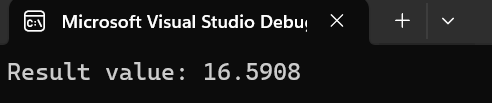
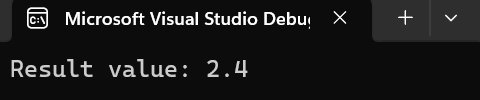

# Лабораторная работа №5 #

## Тема ##

Многопоточность

## Цель работы ##

Научиться работать с многопоточностью в приложениях.

Необходимо написать 2 программы, используя в них несколько потоков. Одну из программ реализовать через атомные переменные, вторую – через **mutex**. Отчёт должен содержать цель работы, код программы, скриншот работы программы и вывод по лабораторной работе.

Новые потоки создавать следующим образом:

## Вариант 3 ##

## Реализация/ход работы ##

### Условие ###

Создать три потока, выполняющих различные арифметические операции над переменной типа ***float***.

Atomic.cpp

```c++
Операция сложения
std::thread thread1 = std::thread([] {
	result_value.store(result_value.load() + 1.26, std::memory_order_relaxed);
	});
	
Операция вычитания
std::thread thread2 = std::thread([] {
	result_value.store(result_value.load() - 1.83, std::memory_order_relaxed);
	});
	
Операция умножения
std::thread thread3 = std::thread([] {
	result_value.store(result_value.load() * 7.03, std::memory_order_relaxed);
	});

```

Mutex.cpp

```c++

Инкрементирование (увеличение данных)

void increment(float value) {
    std::lock_guard<std::mutex> lock(mutex);
    number += value;
}

Дерементирование (уменьшение данных)

void decrement(float value) {
    std::lock_guard<std::mutex> lock(mutex);
    number -= value;
}

Умножение данных

void multiply(float value) {
    std::lock_guard<std::mutex> lock(mutex);
    number *= value;
}

```


#### Результат работы программы ####

Atomic


Mutex


#### Вывод ####

Научились создавать простейшие классы-наследники.
