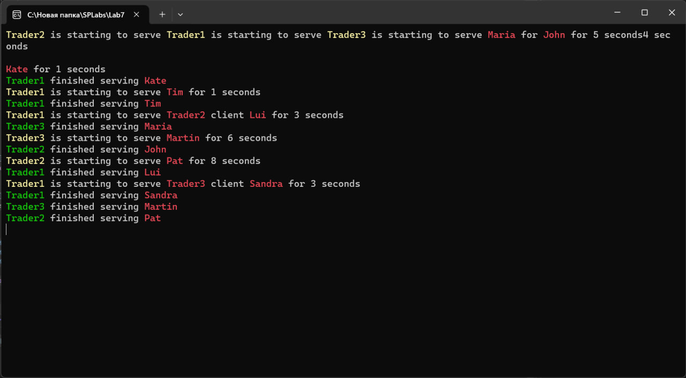

# Лабораторная работа №7 #

## Тема ##

Синхронизация потоков.

## Цель работы ##

Научиться синхронизировать работу с потоками в приложениях.

Необходимо написать программу, используя знания, полученные в лабораторной работе №5. Потоки должны быть синхронизированы для выполнения поставленной задачи или код должен выполнять задачи последовательно.

## Вариант 3 ##

Создать симулятор рынка с минимум 3 торговцами. Торговцы обслуживают по одному человеку в очереди, а после того, как очередь закончилась – начинаю обслуживать людей в очередях других торговцев.

```c++

...
// Класс Trader (Трейдер)
class Trader {
public:
    Trader(const std::string& name) : name(name) {}

    // Метод для обслуживания клиентов
    void serveClients(Trader* otherTrader1, Trader* otherTrader2);

    // Метод для добавления клиента в очередь трейдера
    void addClient(const Client& client);

    // Метод для получения имени трейдера
    const std::string& getName() { return name; }

private:
    std::string name;
    std::queue<Client> clientsQueue;
    std::mutex queueMutex; // Мьютекс для безопасной работы с очередью клиентов
    std::condition_variable queueCondition; // Условная переменная для синхронизации
};

// Метод обслуживания клиентов трейдера
void Trader::serveClients(Trader* otherTrader1, Trader* otherTrader2) {
    while (true) {
        std::unique_lock<std::mutex> lock(queueMutex);

        // Ожидание, пока не появятся клиенты в очереди
        queueCondition.wait(lock, [this] { return !clientsQueue.empty(); });

        if (clientsQueue.empty()) {
            break; // Выход из цикла, если очередь пуста
        }

        Client client = clientsQueue.front();
        clientsQueue.pop();
        lock.unlock();

        {
            std::unique_lock<std::mutex> outputLock(queueMutex);

            // Вывод информации о начале обслуживания клиента
            cout << ANSI_BOLD << "\033[93m" << name << ANSI_RESET
                << " is starting to serve " << ANSI_BOLD << "\033[91m" << client.name << ANSI_RESET
                << " for " << client.serviceTime << " seconds" << endl;
        }

        // Имитация обслуживания клиента
        std::this_thread::sleep_for(std::chrono::seconds(client.serviceTime));

        {
            std::unique_lock<std::mutex> outputLock(queueMutex);

            // Вывод информации о завершении обслуживания клиента
            cout << ANSI_BOLD << "\033[92m" << name << ANSI_RESET
                << " finished serving " << ANSI_BOLD << "\033[91m" << client.name << ANSI_RESET << endl;
        }

        // Обслуживание клиентов других трейдеров
        std::unique_lock<std::mutex> otherLock1(otherTrader1->queueMutex);
        if (!otherTrader1->clientsQueue.empty()) {
            Client otherClient = otherTrader1->clientsQueue.front();
            otherTrader1->clientsQueue.pop();
            otherLock1.unlock();

            {
                std::unique_lock<std::mutex> outputLock(queueMutex);

                // Вывод информации о обслуживании клиента другого трейдера
                cout << ANSI_BOLD << "\033[92m" << name << ANSI_RESET
                    << " served " << ANSI_BOLD << "\033[91m" << otherTrader1->getName() << ANSI_RESET
                    << " client " << ANSI_BOLD << "\033[91m" << otherClient.name << ANSI_RESET
                    << " for " << otherClient.serviceTime << " seconds" << endl;
            }
        }
        else {
            otherLock1.unlock();
        }

        std::unique_lock<std::mutex> otherLock2(otherTrader2->queueMutex);
        if (!otherTrader2->clientsQueue.empty()) {
            Client otherClient = otherTrader2->clientsQueue.front();
            otherTrader2->clientsQueue.pop();
            otherLock2.unlock();

            {
                std::unique_lock<std::mutex> outputLock(queueMutex);

                // Вывод информации о обслуживании клиента другого трейдера
                cout << ANSI_BOLD << "\033[92m" << name << ANSI_RESET
                    << " served " << ANSI_BOLD << "\033[91m" << otherTrader2->getName() << ANSI_RESET
                    << " client " << ANSI_BOLD << "\033[91m" << otherClient.name << ANSI_RESET
                    << " for " << otherClient.serviceTime << " seconds" << endl;
            }
        }
        else {
            otherLock2.unlock();
        }
    }
}

// Метод для добавления клиента в очередь трейдера
void Trader::addClient(const Client& client) {
    std::unique_lock<std::mutex> lock(queueMutex);
    clientsQueue.push(client);
    lock.unlock();
    queueCondition.notify_one(); // Уведомление о наличии нового клиента
}

int main() {
    // Создание трейдеров
    Trader trader1("Trader1");
    Trader trader2("Trader2");
    Trader trader3("Trader3");

    // Создание потоков для трейдеров
    std::thread thread2(&Trader::serveClients, &trader2, &trader1, &trader3);
    std::thread thread1(&Trader::serveClients, &trader1, &trader2, &trader3);
    std::thread thread3(&Trader::serveClients, &trader3, &trader1, &trader2);

    ...

```

#### Результат работы программы ####



#### Вывод ####

Научились синхронизировать работу с потоками в приложениях.

