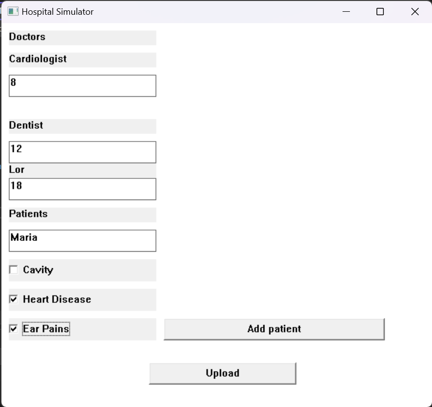

# Лабораторная работа №8 #

## Обобщение знаний ##

## Вариант 3 ##

### Условие ###

Создать симулятор больницы. \
Необходимые классы: разные виды врачей, пациенты.\
Заполняемые с помощью WinAPI данные: вся информация о врачах и пациентах.\
Суть работы: врачи посещают пациентов, за которыми закреплены и лечат определённые симптомы в течение некоторого времени в зависимости от специальности. У врача есть максимальное время лечения, после которого он уходит к следующему пациенту. Два врача не могут одновременно обслуживать одного пациента. Как только пациент вылечен – он выписывается из больницы и врачи больше к нему не ходят. Программа завершается, когда все пациенты вылечены.

### Файлы ###

Программа, написанная с помощью WinAPI


Основная программа

[main.cpp](./src/main.cpp)

Заголовочный DLL файл

[hospitalDLL.h](./include/hospitalDLL.h)

#### Результаты работы программ ####



```c++

Speciality: Cardiologist
Treatment time: 8
Treament methods performs computer tomography  prescribes medicines
Treats heart disease
Name: Dentist
Treatment time: 12
Treament methods drill into the tooth to get rid of cavity  sets brackets
Treats tooth decay and cavity
Name: Lor
Treatment time: 18
Treament methods Examines ears and washes out studs  prescribes ear drops
Treats ear, throat and nose problems
Patient Name: John
Illness: heart disease tooth decay
Patient Name: Maria
Illness: ear studs tooth decay
Patient Name: Lucy
Illness: heart disease ear studs
Patient Name: Kate
Illness: tooth decay ear studs

Cardiologist prescribes medicines John
Dentist sets brackets Maria
Lor Examines ears and washes out studs Lucy
Cardiologist cured John's  heart disease
Dentist cured Maria's  tooth decay
Dentist sets brackets Kate
Lor cured Lucy's  ear studs
Lor prescribes ear drops Maria
Cardiologist prescribes medicines Lucy
Dentist cured Kate's  tooth decay
Dentist sets brackets John
Cardiologist cured Lucy's  heart disease
Lucy is safe and sound
Lor cured John's  tooth decay
Dentist cured Maria's  ear studs
John is safe and sound
Maria is safe and sound
Lor Examines ears and washes out studs Kate
Lor cured Kate's  ear studs
Kate is safe and sound
All patients are cured

```

#### Вывод ####

Создала симулятор больницы. 
