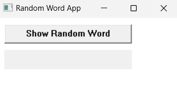
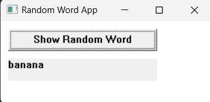

# Лабораторная работа №2 #

## Создание программы с графическим интерфейсом в ОС Windows ##

## Вариант 3 ##

### Цель работы: Научиться создавать простейшие приложения с графическим пользовательским интерфейсом в ОС Windows ###


Обработчик кнопки

```C++
LRESULT CALLBACK WndProc(HWND hwnd, UINT msg, WPARAM wParam, LPARAM lParam) {
    switch (msg) {
    case WM_CREATE: {
        // Создание кнопки
        CreateWindow(L"BUTTON", L"Show Random Word", WS_VISIBLE | WS_CHILD, 10, 10, 200, 30, hwnd, (HMENU)1, NULL, NULL);
        // Создание поля для отображения слова
        CreateWindow(L"STATIC", L"", WS_VISIBLE | WS_CHILD, 10, 50, 200, 30, hwnd, (HMENU)2, NULL, NULL);
        break;
    }
    case WM_COMMAND: {
        if (LOWORD(wParam) == 1) {
            // При нажатии на кнопку
            int randomIndex = getRandomIndex(englishWords.size());
            SetDlgItemTextW(hwnd, 2, englishWords[randomIndex].c_str());
        }
        break;
    }
    case WM_DESTROY: {
        PostQuitMessage(0);
        break;
    }
    default:
        return DefWindowProc(hwnd, msg, wParam, lParam);
    }
    return 0;
}
```

#### Результат работы программы ####



После нажатия




#### Вывод ####

Научились создавать простейшие приложения с графическим пользовательским интерфейсом в ОС Windows.
