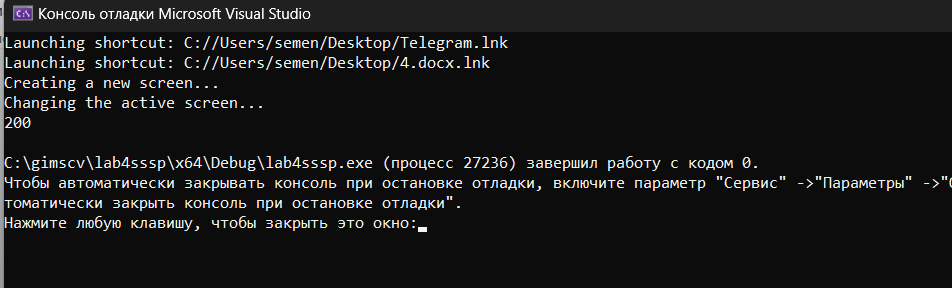

# Лабораторная работа №4 #

## Наследование ##

## Вариант 1 ##


Релизация классов и их функций

```c++
class Window {
public:
    Window(int id, int height, int width, bool areAdministatorRightsGranted)
        : id_(id), height_(height), width_(width),
        memoryNeeded_(0), areAdministatorRightsGranted_(areAdministatorRightsGranted),
        isShown_(false) {}

    virtual void doWork() = 0;
        
    

    virtual void showOrHide() = 0;


protected: 
    int memoryNeeded_;
    bool isShown_;

private:
    int id_;
    int height_;
    int width_;
    
    bool areAdministatorRightsGranted_;
    
};

class Shortcut {
public:
    Shortcut(int id, int size, int xPosition, int yPosition, const char* path)
        : id_(id), size_(size), xPosition_(xPosition), yPosition_(yPosition), path_(path), pathc(path) {}

    void moveShortcut(int newX, int newY) {
        xPosition_ = newX;
        yPosition_ = newY;
    }

    void launchShortcut() {
        std::string path1 = pathc;
        system(pathc);
        system(pathc);
        std::cout << "Launching shortcut: " << path_ << std::endl;
    }

private:
    int id_;
    int size_;
    int xPosition_;
    int yPosition_;
    const char* pathc;
    std::string path_;
};

class DesktopWindow : public Window {
public:
    DesktopWindow(int id, int height, int width, bool areAdministatorRightsGranted,
        const std::vector<Shortcut>& shortcuts, const std::string& backgroundImagePath)
        : Window(id, height, width, areAdministatorRightsGranted),
        shortcuts_(shortcuts), backgroundImagePath_(backgroundImagePath) {}

    void createNewScreen() {

        std::cout << "Creating a new screen..." << std::endl;
    }

    void changeActiveScreen() {

        std::cout << "Changing the active screen..." << std::endl;
    }

    void doWork()
    {
        memoryNeeded_ = 100 * shortcuts_.size();
        std::cout << memoryNeeded_ << std::endl;
    }

    void showOrHide() {
        isShown_ = !isShown_;
        
    }
    

private:
    std::vector<Shortcut> shortcuts_;
    std::string backgroundImagePath_;
};
```

### Результат работы программы ###




#### Вывод ####

Научились создавать простейшие классы-наследники.
