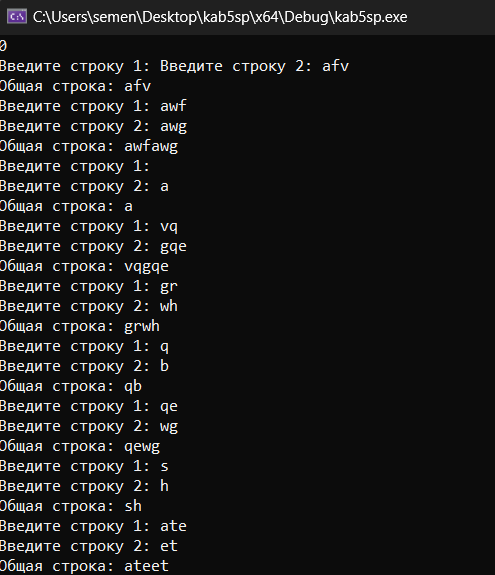
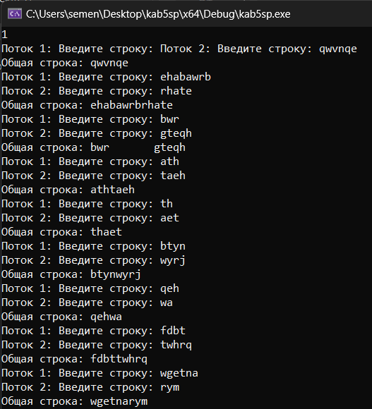

# Лабораторная работа №5 #

## Многопоточность ##

## Вариант 1 ##

## Реализация ##


Реализация mutex и atomic через одну программу:

```c++
std::mutex mtx;
std::condition_variable cv;
std::string sharedString; 
bool firstThreadDone = false; 
std::atomic<bool> is_ready(false);

void readInputM(int threadId) 
{
    std::string input = "";

    std::cout << "Поток " << threadId << ": Введите строку: ";

    std::getline(std::cin, input); 

    std::unique_lock<std::mutex> lock(mtx);

    sharedString += input; 

    if (threadId == 1)
    {
        firstThreadDone = true; 

        cv.notify_one(); 
    }
    else 
    {
        cv.wait(lock, [] { return firstThreadDone; }); 
    }
}

void readInputA(int threadId) {
    std::string input;

    std::cout << "Введите строку " << threadId << ": ";

    std::getline(std::cin, input);

    sharedString += input;

    is_ready.store(true, std::memory_order_release);
}

int main() 
{
    setlocale(LC_ALL, "RUSSIAN");
    bool a;
    std::cin >> a;
    if(a)
    while (true) 
    {
        std::thread t1(readInputM, 1);
        t1.join();

        std::thread t2(readInputM, 2); 
        t2.join();

        std::cout << "Общая строка: " << sharedString << std::endl;

        sharedString.clear();

        //system("pause");
    }
    else 
        while (true)
        {
            std::thread t1(readInputA, 1);
            t1.join();

            std::thread t2(readInputA, 2);
            t2.join();

            std::cout << "Общая строка: " << sharedString << std::endl;

            sharedString.clear();

            //system("pause");
        }

```

#### Результаты работы программ ####

atomic:



mutex:



#### Вывод ####

Научились работать с многопоточностью в приложениях.
