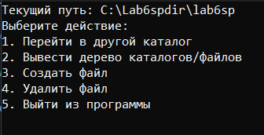
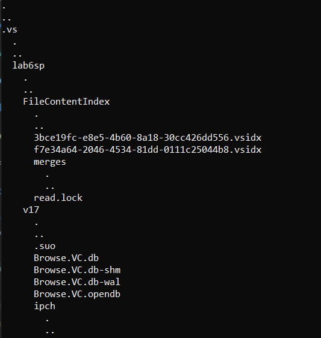

# Лабораторная работа №6 #

## Разработка консольного приложения в Windows ##

## Вариант 1 ##

## Реализация ##

### **Условие** ###

Реализовать консольный файловый менеджер

#### Результат работы программы ####

Меню

Пример работы одной из функций(вывод дерева)

#### Вывод ####

Отработал навыки по созданию консольных приложений в Windows, используя C++.
