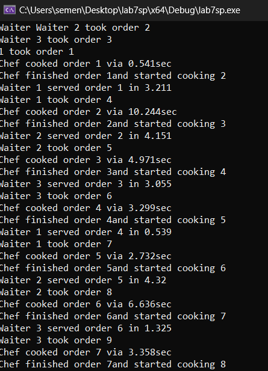

# Лабораторная работа №7 #

## Синхронизация потоков ##

## Вариант 1 ##

### **Условие** ###

Создание классов официанта и шефа
```c++

class Waiter {
public:
    void TakeOrder(int orderNumber) {
        std::unique_lock<std::mutex> lock(mutex_);
        cv_.wait(lock, [this] { return !isCooking_; });
        std::cout << "Waiter " << id_ << " took order " << orderNumber << std::endl;
        isCooking_ = true;
        cv_.notify_all();
    }

    void ServeOrder(int orderNumber) {
        int random = (500 + rand() % 5000);
        Sleep(random);
        std::unique_lock<std::mutex> lock(mutex_);
        cv_.wait(lock, [this] { return isCooking_; });
        std::cout << "Waiter " << id_ << " served order " << orderNumber << " in " << (double)random/1000  << std::endl;
        isCooking_ = false;
        cv_.notify_all();
    }
    void setid(int id) {
        id_ = id;
    }

private:
    int id_;
    bool isCooking_ = false;
    std::mutex mutex_;
    std::condition_variable cv_;
};

class Chef {
public:
    void CookOrder(int orderNumber) {
        int random = (500 + rand() % 10000);
        Sleep(random);
        std::unique_lock<std::mutex> lock(mutex_);
        cv_.wait(lock, [this] { return !isBusy_; });
        std::cout << "Chef cooked order " << orderNumber << " via " << (double)random/1000 << "sec" << std::endl;
        isBusy_ = true;
        cv_.notify_all();
    }

    void FinishOrder(int orderNumber) {
        std::unique_lock<std::mutex> lock(mutex_);
        cv_.wait(lock, [this] { return isBusy_; });
        std::cout << "Chef finished order " << orderNumber << "and started cooking " << orderNumber + 1 << std::endl;
        isBusy_ = false;
        cv_.notify_all();
    }
}
```


#### Результаты работы программ ####


