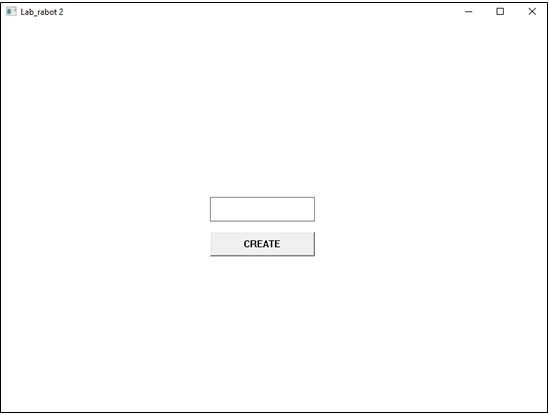
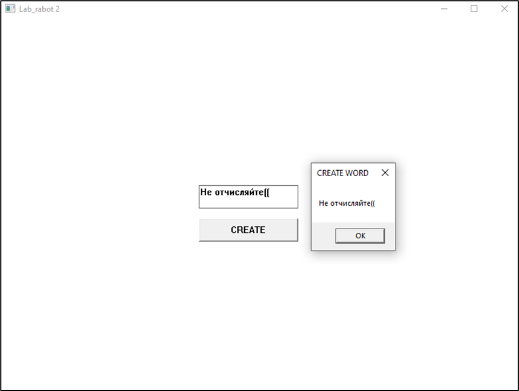

# Лабораторная работа №2 #

## Создание программы с графическим пользовательским интерфейсом в ОС Windows ##

## Вариант 1 ##

## Реализация/ход работы ##

### Цель работы: Научиться создавать простейшие приложения с графическим пользовательским интерфейсом в ОС Windows ###

#### **Условие** ####

Создать приложение с кнопкой и полем для ввода текста. По нажатию на кнопку приложение должно создавать всплывающее окно с введённым текстом.


Создание поля для ввода текста:

``` c++
hEdit = CreateWindow(	
	"eDit",
	"",
	WS_CHILD | WS_VISIBLE | WS_BORDER | ES_LEFT,
	300, 250, 150, 35,
	hWnd, NULL, NULL, NULL
);
```


Создание кнопки:

``` c++
HWND hBtn = CreateWindow(	//кнопка
	"BUTTON",
	"CREATE",
	WS_CHILD | WS_VISIBLE | BS_PUSHBUTTON,
	300, 300, 150, 35,
	hWnd, reinterpret_cast<HMENU>(1), NULL, NULL
);
```


Обработка нажатия кнопки,  всплывающее окно:

``` c++
case 1:
{
	char buf[20];
	GetWindowTextA(hEdit, buf, 19);                     // всплывающее окно
	MessageBoxA(NULL, buf, "CREATE WORD", MB_OK);
	break;
}
```


Регистрация класса окна:

``` c++
RegisterClassEx(&wc);	

```

Создание окна:

``` c++
hWnd = CreateWindow(wc.lpszClassName,
	"Lab_rabot 2",
	WS_OVERLAPPEDWINDOW,
	200, 200, 800, 600,			//координаты относительно левого верхнего угла и размер окна
	NULL, NULL, hInstanse, NULL);
```

Основной цикл обработки сообщений:

``` c++
while (GetMessage(&msg, NULL, 0, 0))	//обработчик сообщений
{
	TranslateMessage(&msg);
	DispatchMessage(&msg);
}
return msg.wParam;

```

#### Результат работы программы ####

Начальное окно: 



Результат:



#### Вывод ####

Научились создавать простейшие приложения с графическим пользовательским интерфейсом в ОС Windows.
