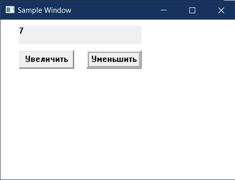

# Лабораторная работа №2 #

## Создание программы с графическим пользовательским интерфейсом в ОС Windows ##

## Вариант 5 ##

## Реализация/ход работы ##

### Цель работы: Научиться создавать простейшие приложения с графическим пользовательским интерфейсом в ОС Windows ###

#### **Условие** ####

Создать приложение с двумя кнопками и полем для отображения числа. По нажатию на кнопки число должно увеличиваться или уменьшаться в зависимости от нажатой кнопки.

Создание статического текста для отображения числа:

``` c++
CreateWindow(TEXT("static"), NULL,//210647
    WS_VISIBLE | WS_CHILD,//210647
    30, 10,//210647
    310, 30,//210647
    hwnd, (HMENU)1, NULL, NULL);//210647
```

Создание кнопки для увеличения числа:

``` c++
CreateWindow(TEXT("button"), TEXT("Увеличить"),//210647
    WS_VISIBLE | WS_CHILD,//210647
    30, 50,//210647
    90, 30,//210647
    hwnd, (HMENU)2, NULL, NULL);//210647
```

Создание кнопки для уменьшения числа:

``` c++
CreateWindow(TEXT("button"), TEXT("Уменьшить"),//210647
    WS_VISIBLE | WS_CHILD,//210647
    140, 50,//210647
    90, 30,//210647
    hwnd, (HMENU)3, NULL, NULL);//210647
```

Обработка нажатия кнопки:

``` c++
if (LOWORD(wParam) == 2) { // Обработка нажатия кнопки "Увеличить"//210647
    number++;//210647
}
else if (LOWORD(wParam) == 3) { // Обработка нажатия кнопки "Уменьшить"//210647
    number--;//210647
}
```

Обновление текста статического элемента для отображения нового числа:

``` c++
TCHAR newText[20];//210647
_stprintf_s(newText, TEXT("%d"), number); //210647
SetDlgItemText(hwnd, 1, newText);//210647
break;//210647
```

Регистрация класса окна:

``` c++
const wchar_t CLASS_NAME[] = L"Sample Window Class";//210647
WNDCLASS wc = {};//210647
wc.lpfnWndProc = WndProc;//210647
wc.hInstance = hInstance;//210647
wc.lpszClassName = CLASS_NAME;//210647
```

Создание окна:

``` c++
HWND hwnd = CreateWindowEx(
    0,//210647
    CLASS_NAME,//210647
    L"Sample Window",//210647
    WS_OVERLAPPEDWINDOW,//210647
    CW_USEDEFAULT, CW_USEDEFAULT,//210647
    400, 150,//210647
    nullptr, nullptr, hInstance, nullptr);//210647

if (hwnd == nullptr) {//210647
    return 0;//210647
}
```

Основной цикл обработки сообщений:

``` c++
MSG msg = {};//210647
while (GetMessage(&msg, nullptr, 0, 0)) {//210647
    TranslateMessage(&msg);//210647
    DispatchMessage(&msg);//210647
}
```

#### Результат работы программы ####

Увеличение числа:


Уменьшение числа:



#### Вывод ####

Научились создавать простейшие приложения с графическим пользовательским интерфейсом в ОС Windows.
