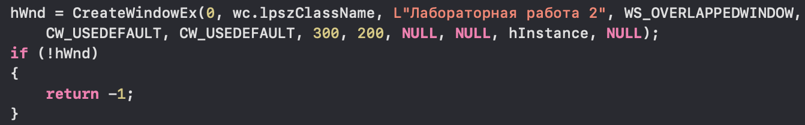
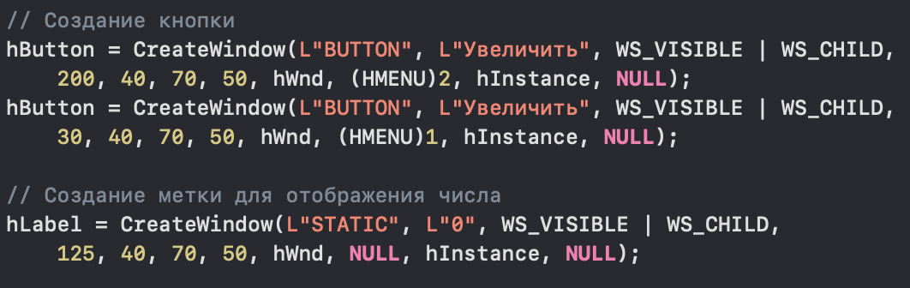
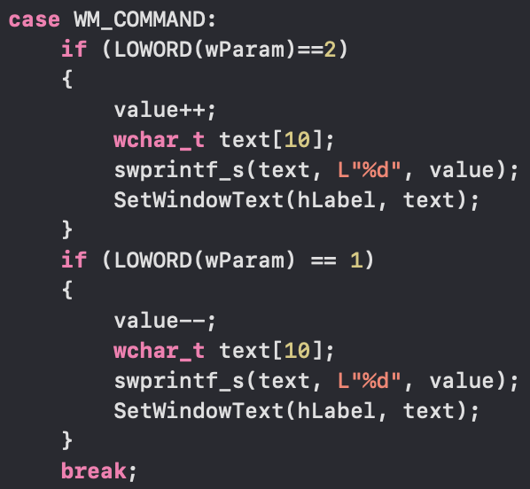

# Лабораторная работа №2 #

## Создание программы с графическим пользовательским интерфейсом в ОС Windows ##

## Цель работы ##

*Научиться создавать простейшие приложения с графическим пользовательским интерфейсом в ОС Windows*

## Вариант 5 ##

### Задание ###

***Создать приложение с двумя кнопками и полем для отображения числа. По нажатию на кнопки число должно увеличиваться или уменьшаться в зависимости от нажатой кнопки.***

1. Создание главного окна 

- 

2. Создание кнопки и метки для отображения числа

- 

3. Обработка нажатия кнопки

- 

4. Результат работы программы

- 
- 
- 

### Вывод ###

***Научился создавать простейшие приложения с графическим пользовательским интерфейсом в ОС Windows.***