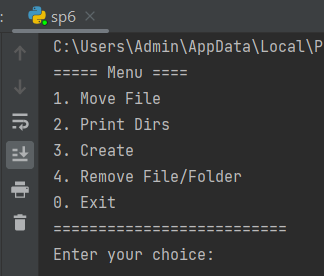
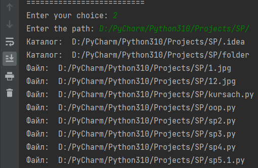
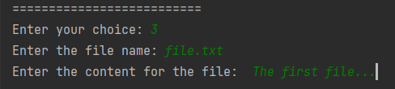
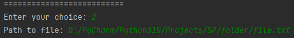

# Лабораторная работа №6

## Разработка консольного приложения в Windows.

## Цель работы: отработать навыки по созданию консольных приложений в Windows

# При запуске программы видим следующее.

При запуске программы видим следующее.

Вывод дерево каталогов/файлов

Переход в разные папки

.png>)

.png>)

Создания файла

.png>)

Удаления файла

