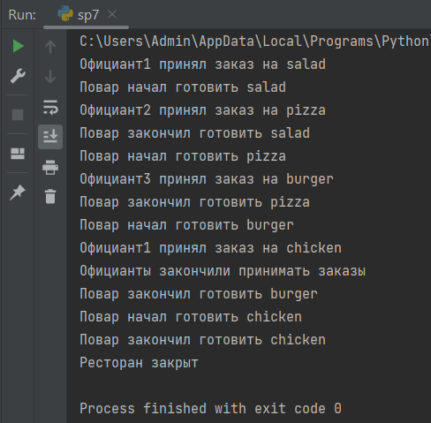

# Лабораторная работа №7

## Синхронизация потоков.

## Вариант 1

## Цель работы: Научиться синхронизировать работу с потоками в приложениях.

### Условие

Создать симулятор ресторана с 3 официантами и 1 поваром. Каждый из официантов умеет принимать заказ, после чего приносит его повару. Повар может готовить лишь один заказ, остальные официанты ждут, пока он освободится.

